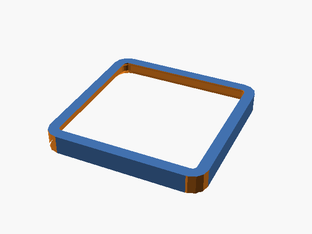
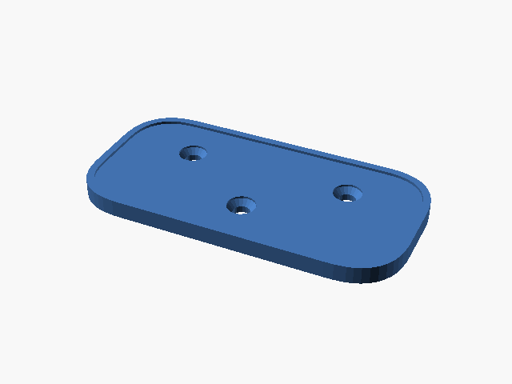
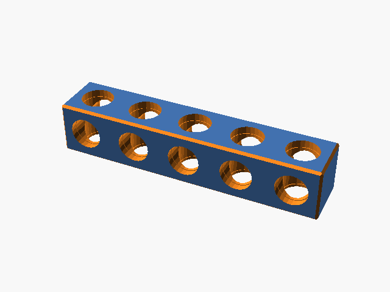
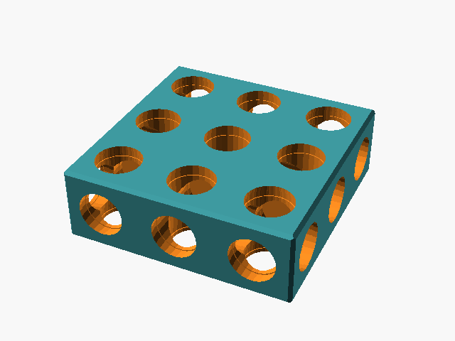
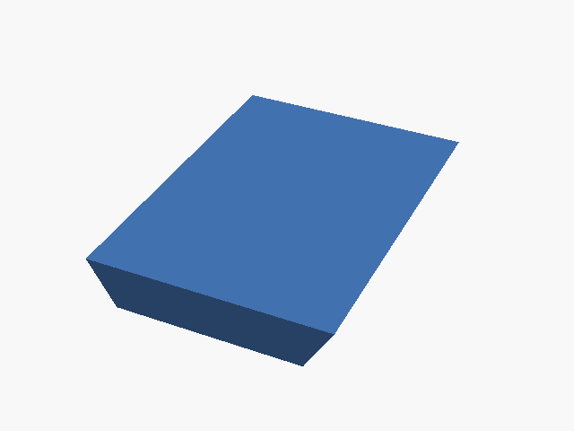
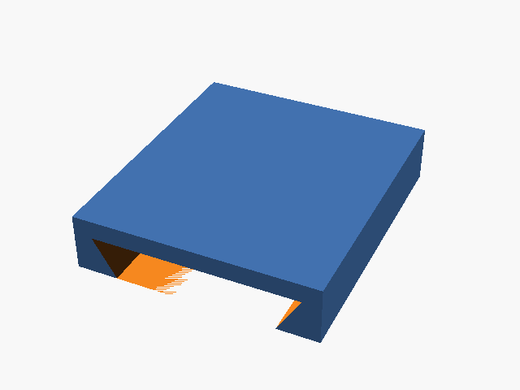
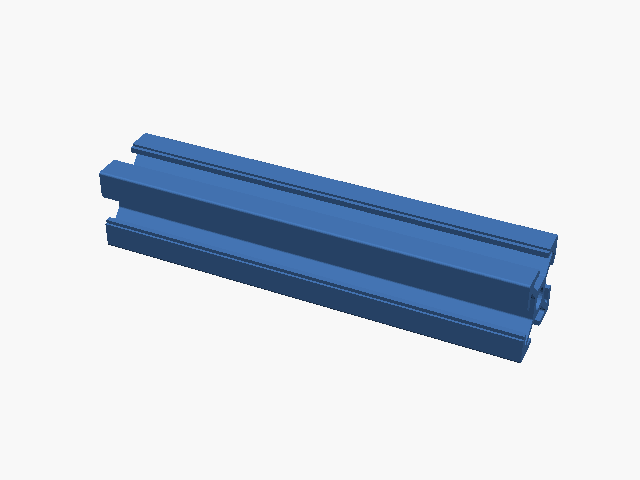

# Connector Foundry

Printable mounting interfaces — Gridfinity, openGrid, GoPro, DeckMate, BitBeam, 2020 extrusion —
as parametric OpenSCAD parts that share one slot convention, so any of them can be combined with
any other. Export a single part as STL, or compose several in the browser and export the result.

Three ways to get a part from the same `.scad` sources:

- **Browser app** (`web/`) — pick a part, set parameters, preview, export STL; combine parts on the
  Bench. Runs entirely client-side via `openscad-wasm`. The primary way to use this.
- **CLI** (`cli/foundry.py`) — `foundry render gridfinity/base --gx 2 --magnets -o out/`
- **OpenSCAD** — open anything under `parts/` or `assemblies/` in the GUI.

## Where the geometry comes from

Where a standard has a reference implementation, this repo calls it instead of re-deriving it.
Those upstreams are vendored under `vendor/` and the files in `parts/` are thin wrappers that add
only the slot convention:

| Upstream | Licence | Used by |
| --- | --- | --- |
| [BOSL2](https://github.com/BelfrySCAD/BOSL2) | MIT | everything (attachments) |
| [gridfinity-rebuilt-openscad](https://github.com/kennetek/gridfinity-rebuilt-openscad) | MIT | `gridfinity/base`, `gridfinity/baseplate` |
| [GoProScad](https://github.com/ridercz/GoProScad) | MIT | `gopro/*` |
| [QuackWorks](https://github.com/AndyLevesque/QuackWorks) | CC-BY-NC-SA 4.0 | `opengrid/*` |
| [bitbeam-lib](https://github.com/ondratu/bitbeam-lib) | BSD-3-Clause | `bitbeam/beam`, `bitbeam/plate` |
| [technic.scad](https://github.com/cfinke/technic.scad) | MIT | `bitbeam/pin`, `bitbeam/axle` |
| [AluminumExtrusionProfile](https://github.com/ServerNinja/OpenSCAD_AluminumExtrusionProfile_Library) | Apache-2.0 | `extrusion2020/rail` |
| [Mechanism](https://getmechanism.com/pages/digital-files) (STL files) | CC BY-NC 4.0 | `deckmate/*` |

The 2020 fittings are modelled here from dimensions measured off
[NopSCADlib](https://github.com/nophead/NopSCADlib)'s E2020t (GPL, so measured against, never
vendored). Specifications consulted: [gridfinity.xyz](https://gridfinity.xyz/specification/),
[opengrid.world](https://www.opengrid.world/guides/board/), [bitbeam.cc](https://bitbeam.cc/).
Each catalogue entry links its own source; see "Licensing" for what the non-MIT ones mean for you.

## Quick start

```bash
git clone --recurse-submodules <repo-url>
cd connector-foundry
python3 -m venv .venv && .venv/bin/pip install -e ".[dev]"
.venv/bin/python cli/foundry.py list
.venv/bin/python cli/foundry.py render gridfinity/base --gx 2 --magnets -o out/
.venv/bin/python -m pytest tests/
```

Web app: `cd web && npm install && npm run dev`. No local OpenSCAD needed — it compiles the same
sources in a Web Worker. See `web/README.md` for the internals. Already cloned without
submodules? `git submodule update --init --recursive`.

## Slot convention

- A part's functional face is its **BOTTOM**, which is also its print orientation.
- The default mount point is a named anchor `"mount"` on **TOP**; larger parts add a
  `mount_<i>_<j>` grid, and parts with more faces add `bot`, `xpos`, `xneg`, `ypos`, `yneg`.
- Attaching through a slot spends it.

Physical constants live in `lib/constants.scad`, or upstream where the geometry is vendored (a
duplicated constant can drift; the few that must be restated are checked). Printer fit tolerance
is the one global, `FIT_CLEARANCE`.

## Joints

`lib/joints.scad` mates two parts through their mount slots in five ways:

- **fused** — plain `attach()`, one body.
- **bolted** — a flange on each side on a shared 4-hole pattern (insert bore one side, clearance
  hole the other).
- **snap** — barbed pegs one side, matching holes the other.
- **pin** — a 4.8 mm bored flange on each side and a real BitBeam pin as a third body.
- **screwed** — for a part that already carries Mechanism's DeckMate three-hole pattern
  (`deckmate/outie`, `deckmate/universal`): at most one generated flange with heat-set insert bores
  at that spacing, on whichever side has no holes. Lets a DeckMate rail print in its own best
  orientation and be fastened on.

Every non-fused joint exposes one `part=` tag per printable body, so each exports to its own STL.

## Bench

The web app's Bench tab is a visual editor. Pick a base part, click a slot marker, attach a part
with a joint, repeat. A part that still has an open anchor after attaching (a Basics plate, any
grid) offers it as a new marker, so assemblies stack. A bench takes up to three attached parts. Each
attached part has:

- **Joint** and **Offset (mm)** — negative sinks it into its parent, positive leaves a gap.
- **Rotation (°)** — turn it on its slot. Click a part in the scene (or its name in the sidebar) to
  select it; ↺/↻ buttons above it turn it in 90° steps, the field takes any angle. Only the part
  turns, never a joint's flanges. Parts whose place in the scene can be computed (catalogue parts
  on top slots) are clickable; imported or side-mounted ones are selected from the sidebar.
- **Move** and **delete**, from the same controls over the selected part. "Move" (or `M`) arms a
  move: the next open slot marker clicked is where the part goes — another slot on the same part or
  a free anchor on a different one — taking its joint, rotation, and anything stacked on it along.
  The arrow keys step it straight to the next open slot in that direction on the base part, no
  arming needed. The trash button, `Delete`, or `Backspace` removes it (and anything attached to
  it); `Esc` cancels a move or drops the selection.
- **Crop** — trim everything else to this part's vertical outline. A plate a few millimetres wider
  than the base it sits on, a bracket whose corner pokes past the rail: turn on Crop for the base
  (the "Crop everything else to this outline" box in the sidebar's root section, or the Crop button
  over a selected part) and whatever sticks out past its footprint, straight up or down, is cut
  away — in the preview and in every exported body. Only the outer outline counts: a grid of holes
  or a screw hole in the cropping part is not cut through the others. One part crops at a time; the
  part itself and a joint's flanges are never trimmed, only what overhangs.
- Its own **parameter editor**, with the same defaults/overrides as the Library.

**STL import** brings in any mesh — a Mechanism or Printables download — as a Bench part: click a
flat face to put a slot at its centre. Meshes are validated and repaired on the way in (welded,
winding fixed) and refused with an explanation if they have real holes. Imports live in your
browser tab only; nothing is fetched or committed.

Export walks the whole tree: one STL per body, or the generated `.scad`.

**Configs and presets** keep a bench setup itself: "Download config" writes a `.bench.json` (parts,
parameters, joints, offsets, rotations, and any imported meshes embedded, so the file stands alone),
"Import config…" loads one back, and "Presets" saves the same document under a name in your browser
to reopen later — from the sidebar of a running bench or from the start screen. The bench also
stays put when you switch to the Library and back, and lives in the page URL, so a reload (or the
link, pasted elsewhere) brings it back — imported meshes excepted, which only the tab that uploaded
them has; use a config file to move those.

## Catalogue

`catalogue.yaml` is the single source of truth: id, system, module, defaults, confidence, source,
print note. The CLI, the tests, the web app and the table below are generated from it (`foundry
readme` after adding a part). Confidence:

- `exact` — from a reference implementation or a published spec, and checked in `references.yaml`
  (or the `source` field says why there is nothing to check against).
- `parametric` — a starting point; verify against your hardware.
- `imported` — Bench-only, for a mesh you brought in.

The BitBeam pin and axle exist for the pin joint and the CLI but are hidden from the part lists:
LEGO-compatible fasteners print poorly, so print real ones or use the finished BitBeam parts.

<!-- CATALOGUE:START -->
| Part | System | Confidence | Licence | Source | Print note |
| --- | --- | --- | --- | --- | --- |
| <br>Bin base | Gridfinity | exact | MIT | [gridfinity-rebuilt-openscad (kennetek, MIT), vendored](https://github.com/kennetek/gridfinity-rebuilt-openscad) | Feet down, no supports. |
| <br>Baseplate | Gridfinity | exact | MIT | [gridfinity-rebuilt-openscad (kennetek, MIT), vendored](https://github.com/kennetek/gridfinity-rebuilt-openscad) | Modelled pockets down so the flat back is the "mount" face; flip it in the slicer to print back-down. Magnets and screw holes only apply to the weighted, skeletonized and screw-together styles. |
| <br>Board | openGrid | exact | CC-BY-NC-SA-4.0 | [QuackWorks openGrid.scad (openGrid by David D, OpenSCAD by BlackjackDuck), vendored. CC-BY-NC-SA — see README "Licensing".](https://github.com/AndyLevesque/QuackWorks) | Grid face up, flat on the bed. A board is exactly cells x 28mm with no border, so boards butt together. lite is 4mm, full 6.8mm, heavy 13.8mm (two halves back to back, with a sealed cavity per cell). |
| <br>Snap | openGrid | exact | CC-BY-NC-SA-4.0 | [QuackWorks opengrid-snap.scad (openGrid by David D, snap by metasyntactic), vendored. CC-BY-NC-SA — see README "Licensing".](https://github.com/AndyLevesque/QuackWorks) | Print in PETG or another filament with some flex so the wings can compress; no supports. The lite snap is half height (3.4mm), which is not the same as a lite board. |
| <br>Two-prong male buckle | GoPro | exact | MIT | [GoProScad (ridercz, MIT), vendored](https://github.com/ridercz/GoProScad) | Legs down; use a brim. Mates with any GoPro three-prong buckle. |
| <br>Three-prong female buckle | GoPro | exact | MIT | [GoProScad (ridercz, MIT), vendored](https://github.com/ridercz/GoProScad) | Legs down; use a brim. nut_depth sinks a captive pocket for an M5 hex nut in the far leg; 0 gives a plain through-hole. nut_sides 4 with nut_dia 11.5 takes a square nut instead. |
| <br>Innie | DeckMate / Mechanism | exact | CC-BY-NC-4.0 | [Mechanism's Universal Grip STL — the manufacturer's own model, imported unmodified. CC BY-NC 4.0 — see README "Licensing".](https://getmechanism.com/pages/digital-files) | The socket half. Flat back up as "mount" (where Mechanism puts the adhesive); the socket side has undercuts, so flip it in the slicer. "bot" sits over the socket recess, not on material. |
| <br>Outie | DeckMate / Mechanism | exact | CC-BY-NC-4.0 | [Mechanism's Bot Print STL — the manufacturer's own model, imported unmodified. CC BY-NC 4.0 — see README "Licensing".](https://getmechanism.com/pages/digital-files) | The rail half; slides into an Innie. Base up as "mount". Fuse it, or use the screwed joint on its three-hole pattern and print the rail on its own, rail up. fill_holes plugs the holes on a fused one. |
| <br>Universal base | DeckMate / Mechanism | exact | CC-BY-NC-4.0 | [Mechanism's Deck Mate Universal STL — the manufacturer's own model, imported unmodified. CC BY-NC 4.0 — see README "Licensing".](https://getmechanism.com/pages/digital-files) | Mechanism's 56.7 x 28.4 x 3mm base plate: hole pattern down as "bot", adhesive face up as "mount". Stack an Outie on "bot" with the screwed joint (no flange needed). Prints flat either way up. |
| <br>Beam | BitBeam | exact | BSD-3-Clause | [bitbeam-lib (ondratu, BSD-3-Clause), vendored; dimensions per bitbeam.cc](https://github.com/ondratu/bitbeam-lib) | Print flat, no supports. 4.8mm holes on an 8mm pitch through top and bottom, and through the sides with side_holes on. LEGO Technic-compatible. |
| <br>Plate | BitBeam | exact | BSD-3-Clause | [bitbeam-lib (ondratu, BSD-3-Clause), vendored; dimensions per bitbeam.cc. Nobody publishes a model of a plate like this, so there is no reference geometry to check against.](https://github.com/ondratu/bitbeam-lib) | Flat on the bed, no supports. Every hole is a real BitBeam hole, top and side. Side holes need height 1 (8mm); go thinner and turn side_holes off. Sizes are in 8mm units. |
| <br>Flat plate | Basics | exact | MIT | Generic geometry, not tied to an external spec | Flat on the bed, no supports. Anchors on all six faces. |
| <br>Round post | Basics | exact | MIT | Generic geometry, not tied to an external spec | Stands on its flat end ("bot"), no supports. |
| <br>Dovetail rail | Basics | exact | MIT | Generic geometry, not tied to an external spec | Tip down, no supports. A generic dovetail, not DeckMate-compatible — import Mechanism's own model for that. |
| <br>Dovetail channel | Basics | exact | MIT | Generic geometry, not tied to an external spec | Mouth down, no supports. Mates with the dovetail rail. |
| <br>T-slot tab (hammer-head) | 2020 Extrusion | parametric | MIT | [Slot geometry measured off NopSCADlib's E2020t (GPL-3.0 — measured against, not vendored)](https://github.com/nophead/NopSCADlib) | Check EX_* in lib/constants.scad against your rail. tab_len up to 6mm drops into the slot face-first and twists to lock; a longer head feeds in from an open end. |
| <br>Snap-in clip | 2020 Extrusion | parametric | MIT | [Slot geometry measured off NopSCADlib's E2020t (GPL-3.0 — measured against, not vendored)](https://github.com/nophead/NopSCADlib) | Check EX_* in lib/constants.scad against your rail. Pushes straight into the slot mid-rail. Print in PETG or nylon so the legs can flex. |
| <br>End-face plate | 2020 Extrusion | parametric | MIT | [Slot geometry measured off NopSCADlib's E2020t (GPL-3.0 — measured against, not vendored)](https://github.com/nophead/NopSCADlib) | Check EX_* in lib/constants.scad against your rail. Keys print face-down; the plate corners overhang them, so add a brim. |
| <br>Corner bracket | 2020 Extrusion | parametric | MIT | [Slot geometry measured off NopSCADlib's E2020t (GPL-3.0 — measured against, not vendored)](https://github.com/nophead/NopSCADlib) | Check EX_* in lib/constants.scad against your rail. Base flange down; check the bore spacing against your T-nuts. |
| <br>Profile C-clip | 2020 Extrusion | parametric | MIT | [Slot geometry measured off NopSCADlib's E2020t (GPL-3.0 — measured against, not vendored)](https://github.com/nophead/NopSCADlib) | Check EX_* in lib/constants.scad against your rail. Snaps over the outside of the profile; print with the ring axis vertical. |
| <br>T-slot rail (printable stand-in) | 2020 Extrusion | parametric | Apache-2.0 | [AluminumExtrusionProfile (Jen Reed, Apache-2.0), vendored — its 2020 preset, which is close to but not E2020t; references.yaml records the gap.](https://github.com/ServerNinja/OpenSCAD_AluminumExtrusionProfile_Library) | A printable stand-in for real rail, for trying fittings and Bench layouts. Lies flat by default; "vertical" stands it on end. Slots along the top at 20mm pitch, on both ends and on the bottom. slot "v" is a V-slot profile. |
<!-- CATALOGUE:END -->

## User overrides

"Gridfinity should always have magnet holes on" is a preference, not a change to the repo. Saved
overrides are a layer on top of the catalogue defaults:

    catalogue default -> saved user override -> this render's value

```bash
foundry defaults set gridfinity/base --magnets   # always on, from now on
foundry defaults show gridfinity/base
foundry defaults clear gridfinity/base
foundry settings set --fit-clearance 0.25        # global: FIT_CLEARANCE
foundry render gridfinity/base --no-user-config  # true catalogue defaults (what tests and CI use)
```

Stored as OpenSCAD Customizer JSON under `~/.config/connector-foundry/`, so a saved file also
opens as a parameter set in the OpenSCAD GUI. The web app does the same resolution in
`localStorage`; a dot marks any field that differs from the catalogue default, and "Save as my
default" works per part. The gear icon holds the global settings — including the part list itself:
untick a system or a single part there and it leaves the Library sidebar and both Bench pickers,
so the list shows only what you actually print. Hidden parts still work in any bench, link, or
config that uses them; "Show all" brings everything back.

## Accuracy

A wrong part still renders, is watertight, and has a stable bounding box. Golden dimensions catch
a part *moving*; only a comparison against someone else's model of the same standard catches it
being *wrong*. `references.yaml` declares those comparisons; `make refs` fetches the sources
(submodules, or pinned commits into gitignored `refs/`) and `make verify` runs them:

- **shape** — our part and the reference through the same OpenSCAD binary: volume, symmetric
  surface distance, and cross-section IoU at declared heights. IoU is what catches a mating profile
  that is the right size and the wrong shape.
- **fit** — our part and its real counterpart in the assembled pose, intersected: interference
  volume and smallest clearance.

`confidence: exact` is a claim, and a test fails if a part makes it without a check behind it. The
harness earned its keep: before it existed, the Gridfinity foot was 5.9 mm undersized, the GoPro
buckles could not interleave at all, the openGrid cells were invented geometry (IoU 0.23), and
three 2020 fittings drove tens to hundreds of mm³ into the rail.

A `kind: file` reference takes a STEP or STL you supply (manufacturer CAD behind a login) — drop
it in `refs/manual/` and uncomment the example in `references.yaml`.

## Licensing

This repository's own files are MIT. Eight parts are not, and each catalogue entry says so:

| Parts | Licence | Why |
| --- | --- | --- |
| `opengrid/board`, `opengrid/snap` | **CC-BY-NC-SA 4.0** | They run `vendor/QuackWorks` code. NonCommercial applies to that use, ShareAlike to adaptations. Upstream licenses *generated tiles* CC-BY, so what you print is unrestricted. |
| `deckmate/innie`, `deckmate/outie`, `deckmate/universal` | **CC BY-NC 4.0** | Mechanism's own STLs, redistributed unmodified under the terms they publish their files under. NonCommercial applies to the files, to prints of them, and to anything fused onto them. The screw pattern's dimensions in `lib/constants.scad` are facts; the generated flange is this repo's MIT code. |
| `bitbeam/beam`, `bitbeam/plate` | **BSD-3-Clause** | Call into `vendor/bitbeam-lib`. Permissive, just not MIT. |
| `extrusion2020/rail` | **Apache-2.0** | Calls into `vendor/AluminumExtrusionProfile`. Permissive, just not MIT. |
| everything else | MIT | — |

BitBeam's own site (bitbeam.cc) is CC-BY-NC-SA and its STL pack is not used; the geometry comes
from `bitbeam-lib`, a separately and permissively licensed implementation by the same author, and
from `technic.scad` for the pin and axle (a BitBeam pin *is* a LEGO Technic pin). NopSCADlib (GPL)
is measured, never called or vendored. `openscad-wasm` bundles OpenSCAD itself (GPL-2.0) as an
external tool the browser runs, the same way the CLI shells out to `openscad`.

## Repo layout

```
lib/             constants, slot/joint conventions, shared helpers
parts/           one .scad per part, grouped by system
assemblies/      example compositions of two or more parts
cli/             foundry.py — render/build/preview/goldens/readme CLI
tools/           reference cache + the comparison engine behind `make verify`
references.yaml  what each part is checked against, and how
tests/           soundness, anchors, recorded dimensions, reference checks
web/             browser app (openscad-wasm)
vendor/          upstream implementations, as git submodules
refs/            reference cache (gitignored)
```
