# Connector Foundry

A library of printable mounting interfaces — Gridfinity, openGrid, GoPro, DeckMate, 2020
extrusion — that you can pull as an STL and drop into Tinkercad, and that compose with each
other through named slots.

OpenSCAD `.scad` files are the source of truth. The same sources drive three ways to get a
part:

- **the browser app** (`web/`) — pick a part, tweak parameters, export an STL, all client-side
  via `openscad-wasm`. This is the primary way to use the library.
- **the CLI** (`cli/foundry.py`) — `foundry render gridfinity/base --gx 2 --magnets -o out/`
- **OpenSCAD directly** — open any file under `parts/` or `assemblies/` in the OpenSCAD GUI.

## Stack

OpenSCAD with the Manifold backend, [BOSL2](https://github.com/BelfrySCAD/BOSL2) for its
attachment system, a Python CLI, and a small React + `openscad-wasm` web app that compiles the
same `.scad` sources in-browser.

Where a standard already has a reference implementation, this repo **calls it** rather than
re-deriving it. Those upstreams are vendored as git submodules under `vendor/`, and the
corresponding files in `parts/` are thin wrappers that add nothing but this repo's slot
convention:

| Submodule | Upstream | Used by |
| --- | --- | --- |
| `vendor/BOSL2` | [BelfrySCAD/BOSL2](https://github.com/BelfrySCAD/BOSL2) | everything |
| `vendor/gridfinity-rebuilt` | [kennetek/gridfinity-rebuilt-openscad](https://github.com/kennetek/gridfinity-rebuilt-openscad) | `parts/gridfinity/` |
| `vendor/GoProScad` | [ridercz/GoProScad](https://github.com/ridercz/GoProScad) | `parts/gopro/` |
| `vendor/QuackWorks` | [AndyLevesque/QuackWorks](https://github.com/AndyLevesque/QuackWorks) | `parts/opengrid/` |

Systems with no reference implementation to call — 2020 extrusion, DeckMate — are modelled
here, and the ones that can be are checked against an independent model instead. See
**Accuracy** below.

## Quick start

```bash
git clone --recurse-submodules <repo-url>
cd connector-foundry
python3 -m venv .venv && .venv/bin/pip install -e ".[dev]"
.venv/bin/python cli/foundry.py list
.venv/bin/python cli/foundry.py render gridfinity/base --gx 2 --magnets -o out/
.venv/bin/python -m pytest tests/
```

Already cloned without `--recurse-submodules`? `git submodule update --init --recursive`.

The web app (`cd web && npm install && npm run dev`) is the primary way most people will use
this: pick a part, tweak parameters, preview it, export an STL — no local OpenSCAD install
needed. It compiles the exact same `parts/`/`lib/` sources via `openscad-wasm` in a Web Worker.
See `web/README.md` for how it's wired up.

## Slot convention

- The functional face of every part is its **BOTTOM** — also its print orientation.
- The default mount point is a named anchor `"mount"` on **TOP**.
- Parts with more faces (plate, post) declare extra named anchors on their other faces.
- Attaching through a slot consumes it: a part attached via `"mount"` no longer offers that
  anchor to further composition.

Physical constants live only in `lib/constants.scad`. For a system whose geometry comes from a
submodule, the constants live upstream and `lib/constants.scad` says so rather than keeping a
second copy — a duplicated constant is a constant that can drift. The few that must be restated
(upstream keeps them file-private, so `use <>` will not import them) are labelled, and a
reference check fails if they drift. Printer fit tolerance goes through one global,
`FIT_CLEARANCE`.

## Joints

`lib/joints.scad` implements three ways to mate two parts through their mount slots:

- **fused** — plain `attach("mount", "mount")`. One printed body.
- **bolted** — a flange fused onto each side's mount face, on a shared 4-hole pattern: an
  insert bore on side A, a clearance hole on side B.
- **snap** — barbed pegs on side A, matching holes on side B.

Bolted and snap assemblies expose `part = "all" | "a" | "b"` so each printable body renders to
its own STL — see `assemblies/`.

## Bench: combine connectors visually

The web app's Bench tab (`web/src/Bench.jsx`) is a visual editor: pick a base part, click one of
its slots, attach something else there with a joint type, repeat — and, if what you just attached
has a "bot" anchor of its own (opposite whichever face it just attached through), keep going: a
Basics plate fused onto a Gridfinity base still offers its bottom face afterward — now facing up,
since attaching flips the part — so a GoPro mount can go on top of *that*, as a real clickable
marker in the scene right along with root's own. This is "stacking" — the assembly is a tree of
any depth, not just root-plus-children. It only goes anywhere for a part built to branch (Basics
plate/post, or any multi-slot grid): a terminal connector (GoPro, 2020-extrusion, DeckMate) only
ever has the one anchor it just spent attaching itself, so nothing further shows up on it — that's
expected, not a missing feature. For now this is deliberately just the one further anchor
("bot") rather than a plate's full set (its side faces — xpos/xneg/ypos/yneg — are a lot more to
take in as text and, with a rotated part, harder to place correctly in 3D too); scoped to the
straightforward "on top of the last thing" case first, with room to grow. Every part placed in the
Bench — root or any depth of child — has its own parameter editor in the sidebar, the same
catalogue-default diff/reset/save-as-default flow as Library mode. Export and the part picker are
unaffected by depth: STL/`.scad` export still walks the whole tree, and both pickers (start a
bench, attach to a slot) group parts by system the same way Library's sidebar does.

Each attached part also has an **Offset (mm)** field next to its joint choice: how far it sinks
into whatever it's directly touching. Negative pushes the two parts into each other (useful for a
boolean union that needs real overlap to avoid a coincident-face sliver, or a deliberately recessed
fit); positive pulls them apart, leaving a gap. Zero — the default — is a plain flush attachment,
same as before this existed.

**STL import** lets you bring in a part that isn't in the catalogue — a Mechanism or Printables
download, say — and use it exactly like any other Bench part: pick it as the root or a child,
click a point on its surface to place a slot there. Rather than dropping the slot at the exact
pixel you clicked, it walks out across every connected, coplanar triangle from the hit point
(`web/src/lib/faceCluster.js`) to find the whole flat face under the cursor and centers the slot
on *that* — click anywhere on a mounting face and land in the middle of it, not wherever the ray
happened to hit. Clicking a face that already has a slot centered on it doesn't add a second one on
top — it just re-selects the existing slot, since the same face always centers to the same point.
A curved or faceted region has no such flat neighbor, so this degrades to the hit triangle's own
point — never worse than a raw click, and exact on any genuinely flat CAD-exported face. Every
upload goes through
a validate-and-repair gate first (`web/src/lib/meshValidate.js`): weld coincident vertices,
check for open/non-manifold edges, fix inconsistent winding and inside-out shells where that's
safe, and refuse — with a plain explanation — a mesh with an actual hole rather than pass it
through and let the boolean fail (or worse, silently produce garbage). STL only for now; STEP
would need OpenCASCADE, which OpenSCAD can't read natively — see `meshValidate.js`'s header for
where that would slot in later.

An imported part gets `confidence: imported` ("we didn't derive this, the user brought it") —
distinct from `exact`/`parametric`/`unverified` below, and never written to `catalogue.yaml`:
imports are session-local, never committed to this repo, shipped as fixtures, or fetched
programmatically from a model site. You supply the file; it lives in your browser tab and
nowhere else.

## Catalogue

`catalogue.yaml` is the single source of truth for what exists: part id, system, module,
default parameters, confidence, and a print note. The CLI, the tests, and this table are all
generated from it — run `foundry readme` after adding a part. Confidence:

- `exact` — published spec or reference implementation; checked in `references.yaml`.
- `parametric` — a starting point. Verify against real hardware before trusting it.
- `unverified` — worse than parametric: known or strongly suspected to be dimensionally wrong
  (currently both DeckMate parts — see their print notes). Kept for the module/slot scaffolding,
  not for printing.
- `imported` — Bench-only, never in this file. See "Bench" above.

<!-- CATALOGUE:START -->
| Part | System | Confidence | Licence | Print note |
| --- | --- | --- | --- | --- |
| 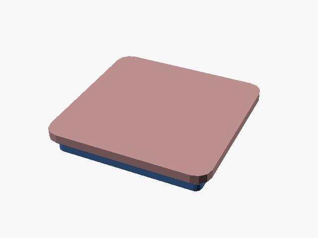<br>Bin base | Gridfinity | exact | MIT | Print as-is, functional face (feet) down. No supports needed. |
| 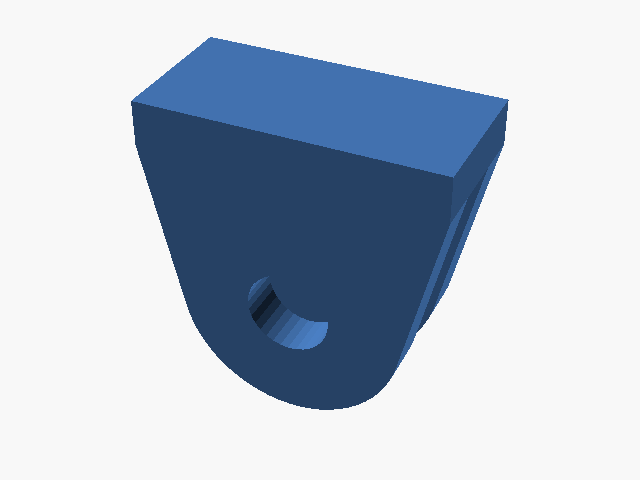<br>Two-prong male buckle | GoPro | exact | MIT | Legs face down for slot consistency; use a brim for first-layer adhesion. Mates with any GoPro-standard three-prong buckle — proved against the upstream model, not just against our own female. |
| 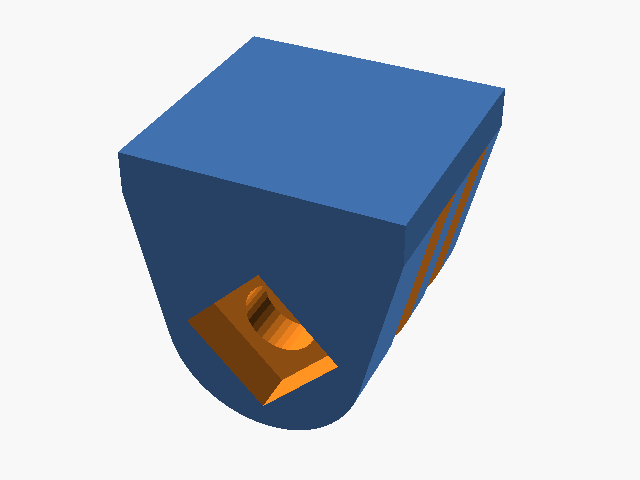<br>Three-prong female buckle | GoPro | exact | MIT | Legs face down for slot consistency; use a brim for first-layer adhesion. nut_depth sinks a captive square-nut pocket in the far leg; set it to 0 for a plain through-hole. |
| <br>Dovetail rail (Outie) | DeckMate | unverified | MIT | KNOWN WRONG — does not mate with a real DeckMate part. Kept for its module/slot scaffolding only, not for printing. The fix isn't another guess at the numbers: import the real Mechanism STL (getmechanism.com/pages/digital-files) or a Printables model into the web Bench instead, where it becomes an "imported"-confidence part with the same slot/joint support as anything else in the catalogue. |
| <br>Dovetail channel (Innie) | DeckMate | unverified | MIT | KNOWN WRONG — does not mate with a real DeckMate part. Kept for its module/slot scaffolding only, not for printing. The fix isn't another guess at the numbers: import the real Mechanism STL (getmechanism.com/pages/digital-files) or a Printables model into the web Bench instead, where it becomes an "imported"-confidence part with the same slot/joint support as anything else in the catalogue. |
| 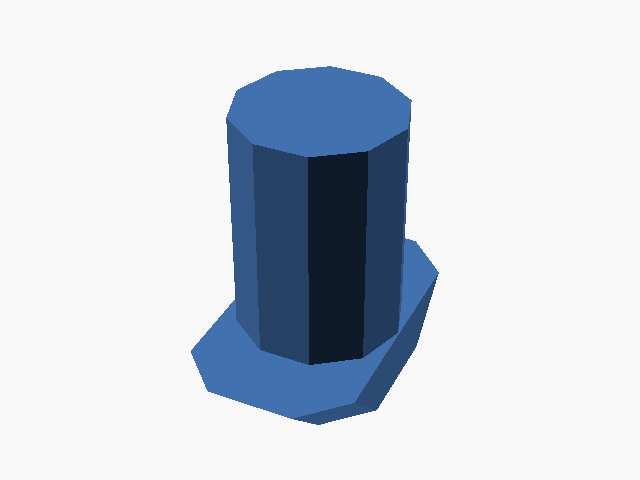<br>T-slot tab (hammer-head) | 2020 Extrusion | parametric | MIT | Supplier-dependent — check EX_* in lib/constants.scad against your rail. Head flanks are chamfered at EX_FLOOR_ANGLE to follow the channel floor. tab_len <= 6mm (the default) drops into the slot face-first and twists 90 degrees to lock, anywhere along the rail; longer heads must be fed in endwise from an open end. |
| 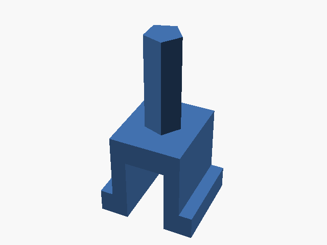<br>Snap-in clip | 2020 Extrusion | parametric | MIT | Supplier-dependent — check EX_* in lib/constants.scad against your rail. Push straight into the slot mid-rail, no end access needed; the legs flex through EX_SLOT_OPEN and the barbs spring out under the lip. Print in a flexible-enough filament (PETG/nylon) — stiff PLA legs may snap. |
| 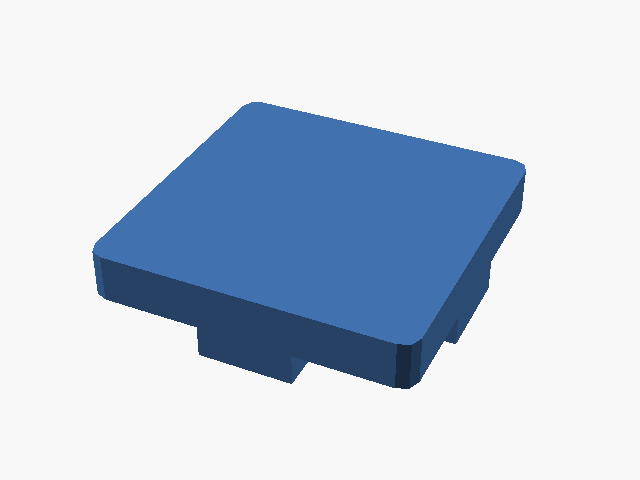<br>End-face plate | 2020 Extrusion | parametric | MIT | Supplier-dependent — check EX_* in lib/constants.scad against your rail. Locating keys print face-down as oriented; the plate overhangs them at its four corners, so add a brim or light support there. |
| 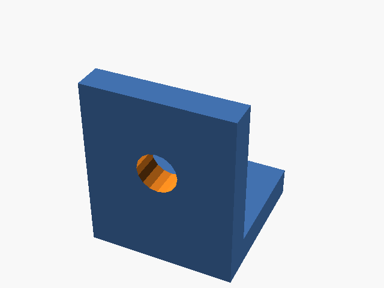<br>Corner bracket | 2020 Extrusion | parametric | MIT | Supplier-dependent — check EX_* in lib/constants.scad against your rail. Print with the base flange down as oriented; the upright flange is a self-supporting 90 degree wall. Bore centers assume the bracket sits centered on each extrusion face — check against your T-nut/bore spacing. |
| 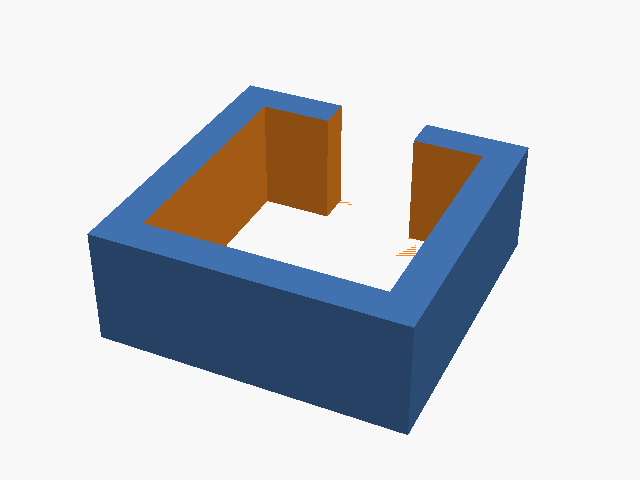<br>Profile C-clip | 2020 Extrusion | parametric | MIT | Supplier-dependent — check EX_* in lib/constants.scad against your rail. Snaps over the OUTSIDE of the extrusion through its open side; print with the ring axis vertical as oriented (zero overhang either way up). Confirm your printer's flex/tolerance can open the gap without cracking. |
| 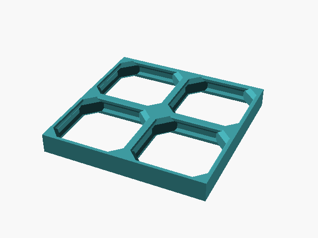<br>Mounting board | openGrid | exact | CC-BY-NC-SA-4.0 | Grid face up, flat on the bed. A tile is exactly cells x 28mm, so boards butt against each other with no border. "full" is the default; "lite" is 4mm, "heavy" is 13.8mm. The heavy tile is two halves back to back with a deliberate gap between them, so it contains one sealed cavity per cell — expected, not a modelling error, but it does mean the interior is unreachable once printed. |
| 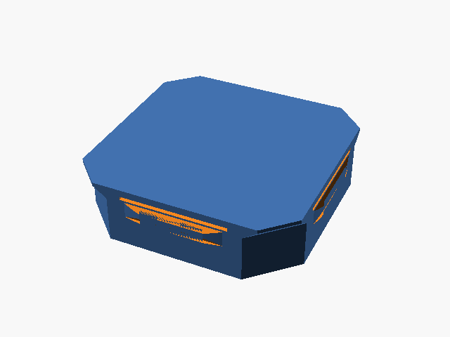<br>Cell snap | openGrid | exact | CC-BY-NC-SA-4.0 | Print in a material with some flex (PETG/PLA+) so the retaining wings can compress; no supports needed. A snap sits within the board's thickness. Note the "lite" snap is a half-height snap (3.4mm), which is not the same thing as a lite tile (4.0mm). |
| 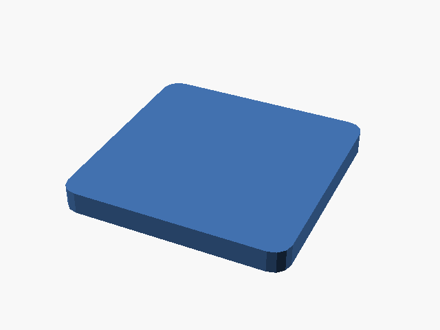<br>Flat plate | Basics | exact | MIT | Flat on the bed, no supports needed. Named anchors on all 6 faces — branch composition off any side, not just top/bottom. |
| 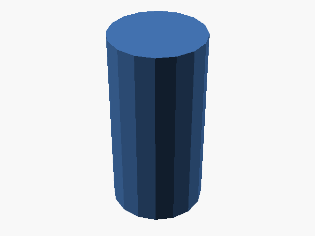<br>Round post | Basics | exact | MIT | Stands upright on its "bot" anchor (flat end down), no supports needed. |
<!-- CATALOGUE:END -->

## User overrides

"Gridfinity should always have magnet holes on" — a personal preference, not a change to what's
in the repo. `catalogue.yaml`'s defaults stay exactly as committed; a saved override is a
separate, persisted layer resolved on top of them:

    catalogue default -> saved user override -> this render's/this instance's value

One resolver implements that order — `cli/foundry.py`'s `resolve_params()` for the CLI,
`web/src/lib/userOverrides.js`'s `resolveParams()` for the web app — so the two can't drift into
disagreeing about which value wins. Saved as [OpenSCAD Customizer
JSON](https://openscad.org/documentation.html#customizer-command-line-interface)
(`fileFormatVersion` + `parameterSets`, one preset named `user-default`) rather than an invented
format — the original plan's own section 6 pointed at this as the way to make parameter sets
data instead of CLI flags, and it means a saved file also opens correctly as a parameter set in
the OpenSCAD GUI.

```bash
foundry defaults set gridfinity/base --magnets   # always render this on, from now on
foundry defaults show gridfinity/base            # catalogue default, your override, and the merge
foundry defaults clear gridfinity/base           # back to plain catalogue defaults
foundry defaults list                            # every part with a saved override

foundry settings set --fit-clearance 0.25        # printer runs tight — same override layer,
foundry settings show                            # just not scoped to one part (lib/constants.scad's
foundry settings clear                           # FIT_CLEARANCE/$slop and friends)

foundry render gridfinity/base                   # picks up both automatically
foundry render gridfinity/base --no-user-config  # true catalogue defaults, ignoring saved overrides —
                                                  # what build/preview/goldens and the test suite always do
```

Saved under `~/.config/connector-foundry/` (`$XDG_CONFIG_HOME` if set), one JSON file per part
plus a reserved `__global__` one for settings — outside the repo, so it never shows up in `git
status` and never leaks into a checkout. `render_part()`'s own default is `use_user_config=False`
for the same reason from the other direction: every render the test suite does passes that
explicitly (`tests/conftest.py`), so a saved override on one developer's machine can't make
`test_dimensions` fail confusingly there and pass in CI — the tests always see true catalogue
values, only `foundry render` (interactively, on purpose) applies your saved overrides.

The web app's Library and Bench both do the same three-layer resolution, backed by
`localStorage` instead of a file (best-effort — wrapped in `try`/`catch`, since a private window
or cleared site data can make it come back empty or throw). Each parameter field shows a small
dot when its current value differs from the catalogue default, with a one-click reset back to
it; "Save as my default" / "Clear my saved default" work on the part as a whole. A gear icon in
the top nav opens the same thing for global settings (FIT_CLEARANCE).

## Accuracy

A part that is the wrong shape still renders, is still watertight, and still has a perfectly
stable bounding box. Golden dimensions cannot catch it; only comparing against somebody else's
model of the same standard can. `references.yaml` declares those comparisons and `make verify`
runs them:

```bash
make refs      # fetch reference sources into refs/ (gitignored)
make verify    # run every check, print the report
```

Two kinds of check:

- **shape** — render our part and the reference through the same OpenSCAD binary, then compare
  volume, symmetric surface distance (sampled both ways, so a missing feature cannot hide), and
  the cross-section outline at declared heights. Section IoU is the one that matters: it catches
  a mating profile that is the right overall size and the wrong shape through its depth, which
  is exactly what volume averages away.
- **fit** — put our part and its real counterpart in the assembled pose and intersect them.
  `interference` is the volume the two solids try to occupy at once; above a print's worth of
  slop they do not go together. `clearance` is the smallest surface-to-surface gap; too much is
  a rattle. The assembled pose is written in OpenSCAD, not in a YAML transform mini-language, so
  the same tool does the transform algebra that does the modelling — and the boolean is
  OpenSCAD's own Manifold kernel, which copes with upstream models a mesh boolean refuses.

`confidence: exact` in the catalogue is a claim, and a test fails if a part makes it without a
check to back it. Current state — all 14 checks pass:

```
pass  gridfinity/base-1x1                 vol 0.00%  rms 0.0000mm  section IoU 1.0000
pass  gopro/male                          vol 0.00%  rms 0.0000mm  section IoU 1.0000
pass  opengrid/board-full-2x2             vol 0.00%  rms 0.0000mm  section IoU 1.0000
pass  gopro/male-into-upstream-female     interference 0.000mm3  clearance 0.2500mm
pass  extrusion2020/tab-in-slot           interference 0.000mm3  clearance 0.0000mm
...
```

Reference sources are never committed. They are either a submodule already in `vendor/`, or a
pinned commit fetched into `refs/` — which is how sources this repo may read and measure but may
not redistribute (CC-BY-NC-SA, GPL) stay out of the tree. Submodule-backed checks run offline;
the rest skip rather than fail without a network.

### Supplier CAD

A `kind: file` reference source takes a STEP (or STL) that you supply yourself — the usual shape
of a real manufacturer reference, since those downloads sit behind logins and cannot be
redistributed. STEP is converted to a millimetre-scaled STL that any recipe can pose with
`import()`, exactly like every other reference. Drop the file in `refs/manual/` and uncomment the
worked example in `references.yaml`.

### What this found

The harness was not written to confirm that the catalogue was fine. Every one of these was
shipping, and three of them were labelled `confidence: exact`:

| Part | Defect |
| --- | --- |
| `gridfinity/base` | The profile sweep applied its offsets inward-and-downward, so the foot was **5.9mm undersized** (29.7mm at the bottom against a real 35.6mm) and the wrong shape throughout. It would rattle in any baseplate. |
| `gopro/*` | The pivot bolt hole ran through a solid block *above* the prongs instead of through the round leg ends. Two buckles could not interleave and bolt together **at all**. |
| `opengrid/*` | Invented geometry: a plain square hole with a made-up top rabbet, against a real cell that is a chamfered-square aperture with a recess at mid-thickness. Boards were also 1.6mm oversize, so they would not tile with real ones. Section IoU **0.23**. |
| `extrusion2020/tab` | Head sized to the channel's centre depth as if it were available at full width. **5.65mm thick into a 2.1mm channel** — 105mm³ of interference. |
| `extrusion2020/endcap` | The locating cross reached 8.5mm in from each face, driving **332mm³** straight through the rail's solid core. |
| `extrusion2020/clip` | Legs sized to the channel depth alone, leaving the barbs still inside the slot mouth with nothing to grip. Also disagreed with `tab` about which axis runs along the rail. |
| `opengrid/snap` | `attachable()` envelope disagreed with the geometry, so every anchor on the part was off. Now guarded generically by `tests/test_anchors.py`. |

## Licensing

This repository's own files are MIT. **Two parts are not**, and the catalogue says so per entry:

| Part | Licence | Why |
| --- | --- | --- |
| `opengrid/board`, `opengrid/snap` | **CC-BY-NC-SA 4.0** | They call into `vendor/QuackWorks`, which is CC-BY-NC-SA repo-wide. Rendering either part runs that code, so NonCommercial applies to that use and ShareAlike applies to adaptations. |
| everything else | MIT | — |

openGrid is designed by David D; the OpenSCAD implementation is by Andy (BlackjackDuck), the snap
by metasyntactic. Upstream separately licenses *generated tiles* CC-BY, so what you print is
unrestricted — the terms attach to running and adapting the script. There is no permissively
licensed openGrid source to use instead: the official
[openGrid-3D/openGrid-openSCAD](https://github.com/openGrid-3D/openGrid-openSCAD) repo carries no
licence and has no board geometry in it.

The MIT-licensed submodules — `gridfinity-rebuilt` (kennetek), `GoProScad` (ridercz), `BOSL2` —
impose nothing on callers, which is why wrapping them was uncomplicated.

Two upstreams are **measured against but never called and never vendored**, because including
them would relicense our parts: `NopSCADlib` (GPL-3.0), used as a model of real 20-series
extrusion for the fit checks. Its numbers — dimensions, which are facts — are recorded in
`lib/constants.scad`; none of its code is here.

`openscad-wasm` bundles OpenSCAD itself (GPL-2.0). It is used as an external tool the browser
fetches and runs, the same way the CLI shells out to the `openscad` binary — no OpenSCAD source
is copied into this repository.

## Repo layout

```
lib/             constants, slot/joint conventions, shared helpers
parts/           one .scad per part, grouped by system
assemblies/      example compositions of two or more parts
cli/             foundry.py — render/build/preview/goldens CLI
tools/           reference cache + the comparison engine behind `make verify`
references.yaml  what each part is checked against, and how
tests/           soundness, anchors, recorded dimensions, reference checks
web/             browser app (openscad-wasm)
vendor/          upstream implementations, as git submodules
refs/            reference cache — fetched, converted, rendered (gitignored)
```

## Sources

Called directly (submodules): [gridfinity-rebuilt-openscad](https://github.com/kennetek/gridfinity-rebuilt-openscad) ·
[GoProScad](https://github.com/ridercz/GoProScad) ·
[QuackWorks](https://github.com/AndyLevesque/QuackWorks) ·
[BOSL2](https://github.com/BelfrySCAD/BOSL2)

Measured against, never vendored: [NopSCADlib](https://github.com/nophead/NopSCADlib)

Specifications: [gridfinity.xyz](https://gridfinity.xyz/specification/) ·
[opengrid.world](https://www.opengrid.world/guides/board/) ·
[Mechanism](https://getmechanism.com/pages/digital-files) (DeckMate — no dimensioned drawing published)
