# Connector Foundry

Printable mounting interfaces — Gridfinity, openGrid, Honeycomb Storage Wall, Skådis, MOLLE, GoPro,
Arca-style plates and tripod threads, DeckMate, BitBeam, 2020 extrusion — as parametric OpenSCAD
parts that share one slot convention, so any of them can be combined with any other. Export a
single part as STL, or compose several in the browser and export the result.

Three ways to get a part from the same `.scad` sources:

- **Browser app** (`web/`) — pick a part, set parameters, preview, export STL; combine parts on the
  Bench. Runs entirely client-side via `openscad-wasm`. The primary way to use this.
- **CLI** (`cli/foundry.py`) — `foundry render gridfinity/base --gx 2 --magnets -o out/`
- **OpenSCAD** — open anything under `parts/` or `assemblies/` in the GUI.

## Where the geometry comes from

Where a standard has a reference implementation, this repo calls it instead of re-deriving it.
Those upstreams are vendored under `vendor/` and the files in `parts/` are thin wrappers that add
only the slot convention:

| Upstream | Licence | Used by |
| --- | --- | --- |
| [BOSL2](https://github.com/BelfrySCAD/BOSL2) | MIT | everything (attachments) |
| [gridfinity-rebuilt-openscad](https://github.com/kennetek/gridfinity-rebuilt-openscad) | MIT | `gridfinity/base`, `gridfinity/bin`, `gridfinity/baseplate` |
| [GoProScad](https://github.com/ridercz/GoProScad) | MIT | `gopro/*` |
| [QuackWorks](https://github.com/AndyLevesque/QuackWorks) | CC-BY-NC-SA 4.0 | `opengrid/board`, `opengrid/snap` |
| [openGrid-projects](https://github.com/mitufy/opengrid-projects) | CC-BY 4.0 | `opengrid/openconnect`, `opengrid/multiconnect`, the Holes tab's openConnect slot and openGrid thread |
| [3d-scad-hsw-customizable](https://github.com/geru/3d-scad-hsw-customizable) | CC-BY 4.0 | `hsw/wall` |
| [3d-scad-hsw-clip](https://github.com/geru/3d-scad-hsw-clip) | MIT | `hsw/insert` |
| [bitbeam-lib](https://github.com/ondratu/bitbeam-lib) | BSD-3-Clause | `bitbeam/beam`, `bitbeam/plate` |
| [technic.scad](https://github.com/cfinke/technic.scad) | MIT | `bitbeam/pin`, `bitbeam/axle` |
| [AluminumExtrusionProfile](https://github.com/ServerNinja/OpenSCAD_AluminumExtrusionProfile_Library) | Apache-2.0 | `extrusion2020/rail` |
| [Mechanism](https://getmechanism.com/pages/digital-files) (STL files; the Adhesive Puck from [their Printables account](https://www.printables.com/model/1337452-mechanismdeckmate-adhesive-puck)) | CC BY-NC 4.0 | `deckmate/*` |

The 2020 fittings are modelled here from dimensions measured off
[NopSCADlib](https://github.com/nophead/NopSCADlib)'s E2020t (GPL, so measured against, never
vendored). Specifications consulted: [gridfinity.xyz](https://gridfinity.xyz/specification/),
[opengrid.world](https://www.opengrid.world/guides/board/), [bitbeam.cc](https://bitbeam.cc/). The
MultiConnect head and slot (`lib/multiconnect.scad`) are modelled here from the published numbers —
openGrid-projects' head, QuackWorks' slot profile — since no permissively licensed implementation
exists to vendor. The Skådis slot, pattern and hook tab (`lib/skadis.scad`) are this repo's
too, for the same reason: the community's Skådis libraries are GPL or unlicensed, and
[parametric-skadis-tower](https://github.com/breckenedge/parametric-skadis-tower) (CC-BY-SA) is
measured against, not vendored. The MOLLE spine, panels and insert (`lib/molle.scad`) are this repo's
from scratch: PALS is defined by its webbing (25.4 mm rows, 25.4 mm apart, bar-tacked every
38.1 mm), rigid panels have no standard at all, and there is no open model to check against, so all are
`parametric`.
Each catalogue entry links its own source; see "Licensing" for what the non-MIT ones mean for you.

## Quick start

```bash
git clone --recurse-submodules <repo-url>
cd connector-foundry
python3 -m venv .venv && .venv/bin/pip install -e ".[dev]"
.venv/bin/python cli/foundry.py list
.venv/bin/python cli/foundry.py render gridfinity/base --gx 2 --magnets -o out/
.venv/bin/python -m pytest tests/
```

Web app: `cd web && npm install && npm run dev`. No local OpenSCAD needed — it compiles the same
sources in a Web Worker. See `web/README.md` for the internals. Already cloned without
submodules? `git submodule update --init --recursive`.

Desktop app: download it for
[Apple Silicon](https://github.com/dnnsmnstrr/connector-foundry/releases/latest/download/Connector-Foundry-mac-apple-silicon.dmg)
or [Intel](https://github.com/dnnsmnstrr/connector-foundry/releases/latest/download/Connector-Foundry-mac-intel.dmg)
Macs, or the Windows installer for
[x64](https://github.com/dnnsmnstrr/connector-foundry/releases/latest/download/Connector-Foundry-windows-x64-setup.exe)
or [ARM](https://github.com/dnnsmnstrr/connector-foundry/releases/latest/download/Connector-Foundry-windows-arm64-setup.exe)
PCs (all versions: [releases](https://github.com/dnnsmnstrr/connector-foundry/releases)),
or run it from source with `cd web && npm ci && npm run desktop`. `npm run desktop:dist` builds the
app for the machine it runs on: a `.app`, DMG and ZIP on a Mac, an installer on Windows (and
`npm run desktop:dist -- --win --x64` builds that installer from a Mac). Native Open/Save dialogs
support STL and bench config files. On a Mac, build and install (or update) the app with
`npm run desktop:install` from `web/`. See [macOS packaging and runtime evaluation](docs/MACOS.md)
and [the Windows build](docs/WINDOWS.md).

## Slot convention

- A part's functional face is its **BOTTOM**, which is also its print orientation.
- The default mount point is a named anchor `"mount"` on **TOP**; larger parts add a
  `mount_<i>_<j>` grid, and parts with more faces add `bot`, `xpos`, `xneg`, `ypos`, `yneg`.
- Attaching through a slot spends it.

Physical constants live in `lib/constants.scad`, or upstream where the geometry is vendored (a
duplicated constant can drift; the few that must be restated are checked). Two are global
settings: printer fit tolerance, `FIT_CLEARANCE`, and how finely curves are faceted,
`CIRCLE_DETAIL` (`draft`, `normal` or `fine`). At `normal` every part renders with the detail it
was written for (Gridfinity and the openGrid connectors with their upstream generators' own
settings); `draft` doubles the facet size for faster renders, `fine` halves it for rounder holes.

## Joints

`lib/joints.scad` mates two parts through their mount slots in five ways:

- **fused** — plain `attach()`, one body.
- **bolted** — a flange on each side on a shared 4-hole pattern (insert bore one side, clearance
  hole the other).
- **snap** — barbed pegs one side, matching holes the other.
- **pin** — a 4.8 mm bored flange on each side and a real BitBeam pin as a third body.
- **screwed** — for a part that already carries Mechanism's DeckMate three-hole pattern
  (`deckmate/outie`, `deckmate/universal`): at most one generated flange with heat-set insert bores
  at that spacing, on whichever side has no holes. Lets a DeckMate rail print in its own best
  orientation and be fastened on.

Every non-fused joint exposes one `part=` tag per printable body, so each exports to its own STL.

## Bench

The web app's Bench tab is a visual editor. Pick a base part, click a slot marker, attach a part
with a joint, repeat. A part that still has an open anchor after attaching (a Basics plate, any
grid) offers it as a new marker, so assemblies stack. A bench takes up to three attached parts. Each
attached part has:

- **Joint** and **Offset (mm)** — negative sinks it into its parent, positive leaves a gap.
- **Shift X / Y (mm)** — slide it sideways on its slot, across the mating face. The two axes are
  the slot's own and turn with the part's rotation, so a correction stays right whichever way the
  part is then turned. Made for an imported STL whose chosen face center isn't quite over the
  feature that should sit on the slot (a buckle whose plate runs further to one side of its
  prongs); catalogue parts put their own `mount` over the right feature already.
- **Rotation (°)** — turn it on its slot. Click a part in the scene (or its name in the sidebar) to
  select it; ↺/↻ buttons above it turn it in 90° steps, the field takes any angle. Only the part
  turns, never a joint's flanges. Parts whose place in the scene can be computed (catalogue parts
  on top slots) are clickable; imported or side-mounted ones are selected from the sidebar.
- **Move** and **delete**, from the same controls over the selected part. "Move" (or `M`) arms a
  move: the next open slot marker clicked is where the part goes — another slot on the same part or
  a free anchor on a different one — taking its joint, rotation, and anything stacked on it along.
  The arrow keys step it straight to the next open slot in that direction on the base part, no
  arming needed. The trash button, `Delete`, or `Backspace` removes it (and anything attached to
  it); `Esc` cancels a move or drops the selection.
- **Crop** — trim everything else to this part's vertical outline. A plate a few millimetres wider
  than the base it sits on, a bracket whose corner pokes past the rail: turn on Crop for the base
  (the "Crop everything else to this outline" box in the sidebar's root section, or the Crop button
  over a selected part) and whatever sticks out past its footprint, straight up or down, is cut
  away — in the preview and in every exported body. Only the outer outline counts: a grid of holes
  or a screw hole in the cropping part is not cut through the others. One part crops at a time; the
  part itself and a joint's flanges are never trimmed, only what overhangs.
- Its own **parameter editor**, with the same defaults/overrides as the Library. A part attached
  to another may start from different values than the same part on its own (the catalogue's
  `attached_defaults`): the openConnect and MultiConnect snaps attach as their head alone
  (`body: none`), the thing you fuse onto a plate to hang it, while the version picked as a base
  keeps its snap body. A saved user default for the parameter still wins. The openConnect head
  also starts turned so its slide direction points up when it lands on a side face, the way it
  hangs on a wall (the catalogue's `attached_up`); the Rotation field turns it from there.

**STL, STEP and 3MF import** bring in any part — a Mechanism or Printables download, a supplier's
CAD file, a slicer project's model — as a Bench part: click a flat face to put a slot at its centre.
A STEP file is converted to a mesh in the browser (OpenCASCADE compiled to WebAssembly, in
millimetres whatever unit the file declares); a 3MF is unpacked and scaled by its declared unit;
one that holds several bodies asks which to use. Meshes are validated and repaired on
the way in (welded, winding fixed) and refused with an explanation if they have real holes. Imports
live in your browser tab only; nothing is fetched or committed.

Export walks the whole tree: one STL per body, or the generated `.scad`. Every exported file is
named after the bench — `<name>_<body>.stl`, `<name>.scad`, `<name>.bench.json` — so a downloads
folder full of them says what each one is. The **Name** field at the top of the sidebar sets it;
a bench exported without one is asked first, with a name built from its parts proposed
(`gridfinity-base_gopro-female`).

**Configs and presets** keep a bench setup itself: "Download config" writes a `.bench.json` (parts,
parameters, joints, offsets, rotations, and any imported meshes embedded, so the file stands alone),
"Import config…" loads one back, and "Presets" saves the same document under a name in your browser
to reopen later — from the sidebar of a running bench or from the start screen. The bench also
stays put when you switch to the Library and back, and lives in the page URL, so a reload (or the
link, pasted elsewhere) brings it back — imported meshes excepted, which only the tab that uploaded
them has; use a config file to move those.

## Holes

The web app's Holes tab puts screw holes into a model. For custom Gridfinity storage, start from
`gridfinity/bin` with `filled` on: a bin solid up to its stacking lip, whose flat top takes any
cavity cut below — a tool's outline from rounded rectangles, magnet pockets, a 2020 socket. Start from a catalogue part (its
parameters stay editable under a toggle in the sidebar while you work), a mesh of your own (STL, STEP or 3MF), or the
bench as it stands, then click a face: the
hole snaps to that face's significant points — its center, the center of each quadrant, the
center of any hole already through it, and a point set in from each corner (the inset is
adjustable; a plate with rounded corners gets its corner points where the sharp corners would be).
Hovering a face also draws guide lines — its center and quarter lines, a radial from the center
to each corner, and a circle of a radius you choose around the center: the crossings are snap
points (a bolt circle of up to eight), and a click near a line or the circle lands on it, so a hole
can go anywhere along the center line and still be exactly centered. Hold Option to see the
pointed-at spot's distances to the face's edges and center, and the face's size; Shift-click places
exactly where you click.

Each hole has a diameter, a depth (or goes right through) and a head pocket — counterbore,
countersink (with its angle), or a hex pocket for a nut trap — from a preset or typed in. The
presets cover the usual suspects, each drawn as a cross-section so you can see what it cuts:
M2–M6 socket caps (ISO 4762), M3–M6 countersunk (ISO 10642), button heads (ISO 7380), heat-set
insert bores, thread-forming core holes for a machine screw straight into plastic, nut traps
(ISO 4032), wood screws and their pilots, a plain hole, a dowel, and a **BitBeam / LEGO Technic
pin hole** — a beam's own hole (Ø4.8 with the groove a pin's tip clicks into, `lib/pinhole.scad`,
checked against bitbeam-lib's beam), one beam (8 mm) deep with a groove at its bottom too, or through. Clearances are ISO 273 medium;
treat every one as a starting point for your printer and measure the first print. A selected hole
can be edited on its own, and whatever screw was picked or edited last is what the next holes get.
Shift-click holes — in the list, or their rings in the scene — to select several: the editor then
shows the values they share (the rest say "mixed" until you set them) and a change applies to all
of them, a preset picked makes them all that kind, the quarter-turn buttons turn each slot from
its own direction, and Delete removes them all. Shift-click on a bare face still places a hole
exactly where you click.

**Repeat…** turns the selected hole into a pattern of the same hole on its face: a row (count,
spacing, across or up the face), a grid (holes and spacing both ways, every other row optionally
staggered half a step) or a circle (count and radius round the hole's spot, the hole itself moving
onto the circle or staying in the middle). The copies are previewed in green; any that would miss
the face — past its edge, into another hole — are left out and counted, and afterwards the whole
pattern is selected to edit or delete together.

A **Skådis slot** preset (a 5 × 15 mm pill, 0.2 mm wider so a printed one takes moulded hooks)
with the grid's **Skådis spacing** (40 mm across, 20 mm up, staggered) turns any face into a Skådis
board, for Skådis hooks or `skadis/peg`. A circle can be filled with the same spacing instead of a
ring: every point of the pattern within its radius, centred on the selected slot.

Two **tripod nut trap** presets take a 1/4"-20 or 3/8"-16 hex nut (camera and tripod-head
threads), so any part screws onto a tripod; `camera/tripod_socket` prints the thread instead.

Two more preset groups cut **connector slots** rather than screw holes, so any part becomes a
custom mount for an openGrid board: an **openConnect** slot (the keyhole an `opengrid/openconnect`
snap's head slides into — upstream's own geometry, with its lock nub on the left, right, both
sides or neither, and its two clearances) and a **MultiConnect** slot (for an `opengrid/multiconnect`
snap or any Multiboard connector: a channel of the length you choose — one openGrid cell, 28 mm, by
default — running down from the round end the head rests in, with an on-ramp funnel at the entry
and the v2 detent, each optional). For an item that hangs on several heads one above the other, tick
"On-ramp every 28 mm" and make the channel a multiple of 28 mm: there is then a ramp one cell below
every seat, so the item goes onto all its heads at once and slides down one cell. A slot
has a direction on its face — the way the head travels to seat, "up" on the wall — which starts
pointing straight up on a vertical face (the part's own Y on one lying flat) and turns in the sidebar; the viewer draws each slot's outline, entry and an arrow
for it. The point you click is the openGrid cell centre for an openConnect slot (the head seats
3.6 mm up from it) and the round end for a MultiConnect one; an openConnect slot needs about 3 mm
of material under the surface, a MultiConnect slot about 4.5 mm.

The **openGrid thread** presets cut the other half of openGrid's screw connectors: the 16 mm,
3 mm-pitch female thread of upstream's threaded snaps, so the openConnect and MultiConnect snaps'
`body: screw` — the same head on a male thread instead of a snap — screws straight into the part.
It has a direction too: the thread starts where it has to for a screwed-home head to point that
way, so an openConnect head ends up with its slide direction up. "Full" is 8 mm deep for a
full-size screw (6.8 mm of thread), "Lite" 4.5 mm for a lite one; depth, through and the
clearance (upstream's 0.5 mm) are editable.

The **Generic shapes** cut a plain cutout of any size instead of a fastener's hole: a **round** one
(a diameter and a depth, or through) and a **rectangle** (width, height, depth, and a corner radius
— half the narrower side, or the "Pill" tick, makes it a pill with round ends). A rectangle has a
direction like a slot: its height runs up the face unturned, and it turns in the sidebar.
The **KLIPPT** presets cut a KLIPPT clip's own channel (`lib/klippt.scad`, from FH's clip, CC BY-SA
4.0), so the part slides onto a `klippt/base` the way a KLIPPT clip does: its lips, the gap the
base's flange slides into and its lock are the clip's. Click where the seated base's centre goes;
the arrow is the way it slides in. "Pocket" adds a drop-in pocket at the entry, for a channel in
the middle of a face; "Run-out" leaves the entry open instead, with a lead-in of the length you
choose, for one cut at an edge. A KLIPPT clip grips the base's neck by bending its lips, which a
rigid part can't, so the channel is cut with a **clearance** (0.3mm a side by default) that moves
each side out: the base then seats free, with a small bump at the entry to hold it in, and the lock
still stops it. 0 cuts the clip exactly; 0.45 and up slides freely. references.yaml checks a base
in it: free in the pocket, free seated at 0.3, gripped just as by the clip at 0.

The **Magnets & bearings** presets are round pockets for 6×2, 8×3 and 10×3 mm disc magnets, a
25×4.5 mm pot magnet and a 608 bearing, each 0.2 mm over in diameter and depth. The pot magnet
also comes with an M4 clearance hole through the pocket's floor, for the screw through its
countersunk centre.

Two print options go on the holes they make sense for. **Chamfer** (round, rectangle and 2020
cutouts) bevels the opening at 45°, as a lead-in and to absorb the flared first layers of a hole
printed opening-down. **Teardrop on walls** (round and screw holes, and the 2020 socket's bolt hole)
cuts a hole in a wall with a 45° point at its top, so it prints without the top sagging; a screw
hole's counterbore goes teardrop with it and a nut trap stands on a corner. "Up" is the model's +Z,
the way it prints, and a hole in a face lying flat stays round. Picking another preset keeps both.

The **2020 extrusion** presets cut a socket that the end of a 20-series aluminium extrusion pushes
into along the hole, so a length of rail stands in the part: the 20 mm square plus a clearance
(0.15 mm a side), 15 mm deep by default, and — "Keyed" — a key into each of the rail's four slot
mouths so it can't turn ("Plain" leaves the square bare). The keys are the end cap's, and
references.yaml's `extrusion2020/rail-in-holes-socket` checks NopSCADlib's E2020t into it with
no interference. Tick "M5 bolt hole" to also cut an M5 clearance hole (Ø5.5) from the socket's
floor out through the far side, for a bolt into the rail's centre bore (tapped M5 on most
20-series profiles) that pulls it down onto the floor; a through socket has no floor, so it gets
none. Click the rail's axis; depth, through, clearance and direction are editable.

Export the result as an
STL, or as `.scad` — `difference() { part; holes }` over the same sources, so it keeps working
with a native OpenSCAD.

## Catalogue

`catalogue.yaml` is the single source of truth: id, system, module, defaults, confidence, source,
print note. The CLI, the tests, the web app and the table below are generated from it (`foundry
readme` after adding a part). Confidence:

- `exact` — from a reference implementation or a published spec, and checked in `references.yaml`
  (or the `source` field says why there is nothing to check against).
- `parametric` — a starting point; verify against your hardware.
- `imported` — Bench-only, for a mesh you brought in.

The BitBeam pin and axle exist for the pin joint and the CLI but are hidden from the part lists:
LEGO-compatible fasteners print poorly, so print real ones or use the finished BitBeam parts.

<!-- CATALOGUE:START -->
| Part | System | Confidence | Licence | Source | Print note |
| --- | --- | --- | --- | --- | --- |
| 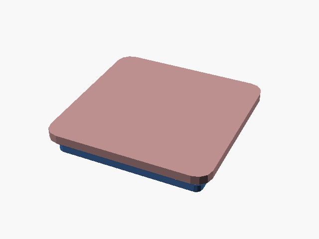<br>Bin base | Gridfinity | exact | MIT | [gridfinity-rebuilt-openscad (kennetek, MIT), vendored](https://github.com/kennetek/gridfinity-rebuilt-openscad) | Feet down, no supports. |
| 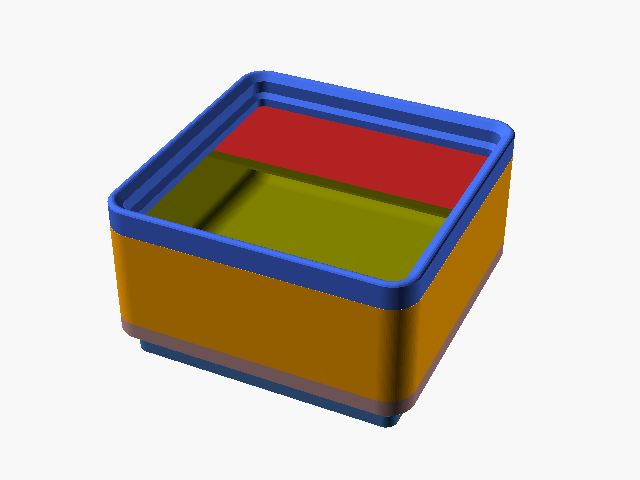<br>Bin | Gridfinity | exact | MIT | [gridfinity-rebuilt-openscad (kennetek, MIT), vendored — its bin generator's new_bin()/bin_render()](https://github.com/kennetek/gridfinity-rebuilt-openscad) | Feet down, no supports. gz is the height in 7mm units, the stacking lip on top. filled makes it solid up to the lip, with a flat top to cut your own cavities into in the Holes tab; divx/divy, scoop and tabs apply to a bin with compartments. |
| 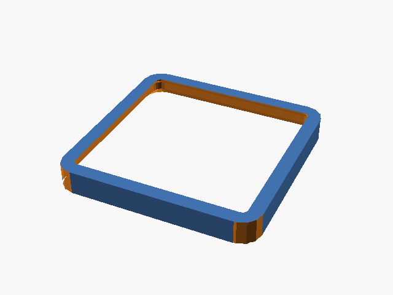<br>Baseplate | Gridfinity | exact | MIT | [gridfinity-rebuilt-openscad (kennetek, MIT), vendored](https://github.com/kennetek/gridfinity-rebuilt-openscad) | Modelled pockets down so the flat back is the "mount" face; flip it in the slicer to print back-down. Magnets and screw holes only apply to the weighted, skeletonized and screw-together styles. |
| 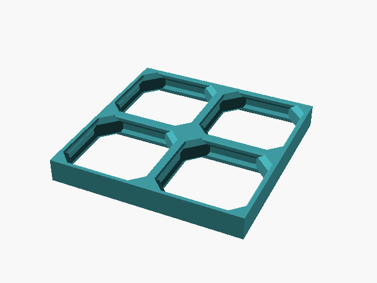<br>Board | openGrid | exact | CC-BY-NC-SA-4.0 | [QuackWorks openGrid.scad (openGrid by David D, OpenSCAD by BlackjackDuck), vendored. CC-BY-NC-SA — see README "Licensing".](https://github.com/AndyLevesque/QuackWorks) | Grid face up, flat on the bed. A board is exactly cells x 28mm with no border, so boards butt together. lite is 4mm, full 6.8mm, heavy 13.8mm (two halves back to back, with a sealed cavity per cell). |
| 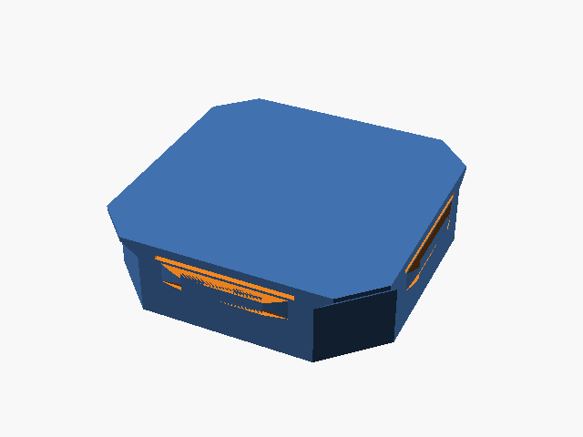<br>Snap | openGrid | exact | CC-BY-NC-SA-4.0 | [QuackWorks opengrid-snap.scad (openGrid by David D, snap by metasyntactic), vendored. CC-BY-NC-SA — see README "Licensing".](https://github.com/AndyLevesque/QuackWorks) | Print in PETG or another filament with some flex so the wings can compress; no supports. The lite snap is half height (3.4mm), which is not the same as a lite board. |
| 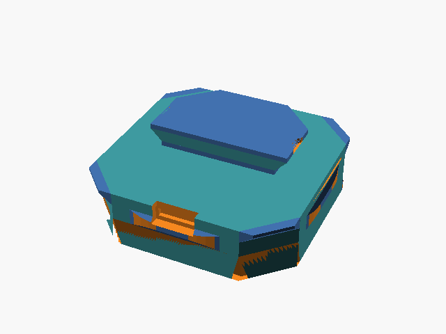<br>openConnect snap | openGrid | exact | CC-BY-4.0 | [openGrid-projects (mitufy, CC-BY 4.0), vendored — its snap body and openConnect head, as its parametric snap generator renders them (text label off).](https://github.com/mitufy/opengrid-projects) | Snap on the bed, head up; no supports (the head's taper is 45°). Goes into any openGrid board cell; anything with an openConnect slot (Holes tab) or a MultiConnect slot hangs on it. The lite snap is half height (3.4mm) for lite boards. directional is the body for a wall-mounted board — its deeper back nub takes the load — symmetric for a horizontal one. body none is the head alone, for fusing onto another part (the Bench's default when attaching it). body screw is the head on openGrid's 16mm snap thread instead of a snap (upstream's openConnect screw): print it thread down, then screw it into a threaded openGrid snap or into the openGrid thread the Holes tab cuts, turning it by the coin slot in its face. Screwed home, the head points the way a snap's does. variant picks the thread length (full 6.8mm, lite 3.4mm). |
| 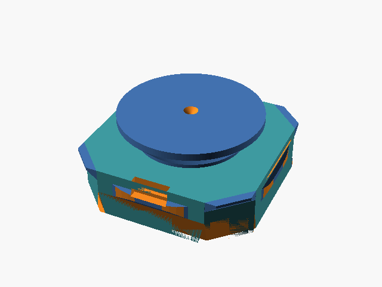<br>MultiConnect snap | openGrid | exact | CC-BY-4.0 | [openGrid-projects (mitufy, CC-BY 4.0), vendored, for the snap body; the MultiConnect head is this repo's own, from the published numbers (lib/constants.scad), checked against the head that generator renders.](https://github.com/mitufy/opengrid-projects) | Snap on the bed, head up; no supports. Hangs any Multiboard accessory — or anything with a MultiConnect slot from the Holes tab — off an openGrid board. variant and body as for the openConnect snap, body none being the head alone for fusing onto another part, body screw the head on openGrid's snap thread (a coin slot across the disc instead of the dimple). |
| 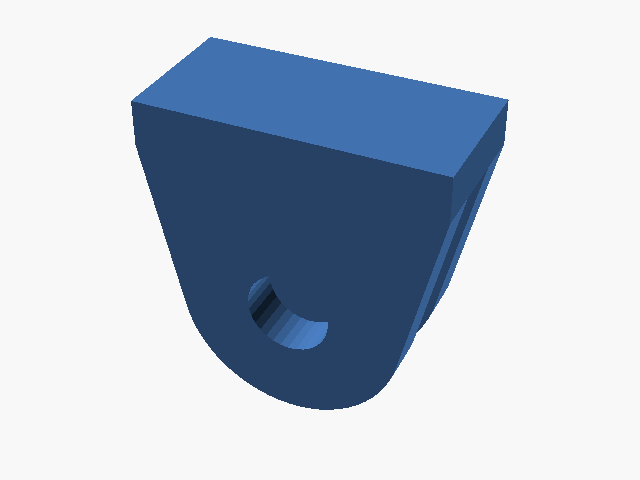<br>Two-prong male buckle | GoPro | exact | MIT | [GoProScad (ridercz, MIT), vendored](https://github.com/ridercz/GoProScad) | Legs down; use a brim. Mates with any GoPro three-prong buckle. |
| 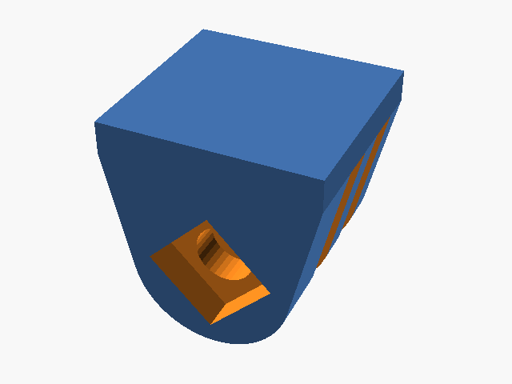<br>Three-prong female buckle | GoPro | exact | MIT | [GoProScad (ridercz, MIT), vendored](https://github.com/ridercz/GoProScad) | Legs down; use a brim. outer_w is the far outer leg's width: the standard 3mm leg plus a captive pocket for an M5 hex nut in the rest. 3 makes all three prongs the same width, with a plain through-hole and no pocket. nut_sides 4 with nut_dia 11.5 takes a square nut instead. A far leg wider than the near one runs the plate further to that side; "mount" sits over the middle prong regardless. symmetric pads the near leg to outer_w too, for a plate centred on the prongs. |
| 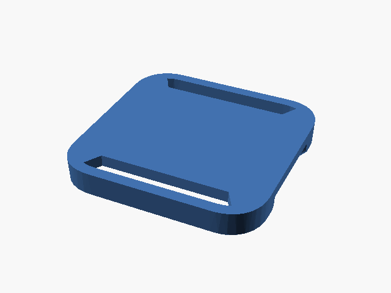<br>Innie | DeckMate / Mechanism | exact | CC-BY-NC-4.0 | [Mechanism's Universal Grip STL — the manufacturer's own model, imported unmodified. CC BY-NC 4.0 — see README "Licensing".](https://getmechanism.com/pages/digital-files) | The socket half. Flat back up as "mount" (where Mechanism puts the adhesive); the socket side has undercuts, so flip it in the slicer. "bot" sits over the socket recess, not on material. |
| 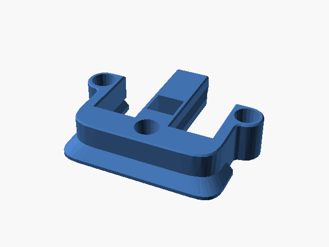<br>Outie | DeckMate / Mechanism | exact | CC-BY-NC-4.0 | [Mechanism's Bot Print STL — the manufacturer's own model, imported unmodified; slim is cut from Mechanism's Adhesive Puck STL (printables.com/model/1337452, also unmodified). CC BY-NC 4.0 — see README "Licensing".](https://getmechanism.com/pages/digital-files) | The rail half; slides into an Innie. Base up as "mount". Fuse it, or use the screwed joint on its three-hole pattern and print the rail on its own, rail up. fill_holes plugs the holes on a fused one. slim is Mechanism's own slim Outie, from its Adhesive Puck: no ears for the side holes and the U's outer edge brought in, 30.6mm wide instead of 35.3mm, holes solid — for fusing onto something, not for the screwed joint. |
| 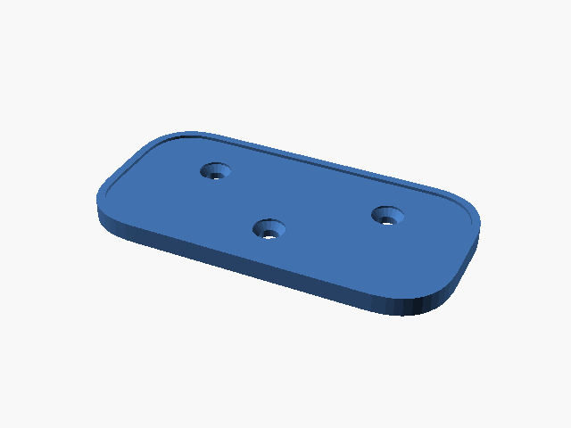<br>Universal base | DeckMate / Mechanism | exact | CC-BY-NC-4.0 | [Mechanism's Deck Mate Universal STL — the manufacturer's own model, imported unmodified. CC BY-NC 4.0 — see README "Licensing".](https://getmechanism.com/pages/digital-files) | Mechanism's 56.7 x 28.4 x 3mm base plate: hole pattern down as "bot", adhesive face up as "mount". Stack an Outie on "bot" with the screwed joint (no flange needed). Prints flat either way up. |
| 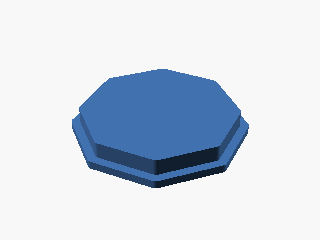<br>Base | KLIPPT | exact | CC-BY-SA-4.0 | [KLIPPT by FH (printables.com/@bequ3) — the designer's own base models (the base STEP, tessellated; the screw base STL), imported unmodified. CC BY-SA 4.0 — see README "Licensing".](https://www.printables.com/model/424351-klippt-locking-cable-clip) | Flange on the bed, no supports. A KLIPPT clip slides on from the side, its lips under the 20mm flange, gripping the 18mm neck. The neck's flat face is "mount": stick or fuse it onto a part, or with screw use the countersunk hole (head on the flange side, under the clip). |
| 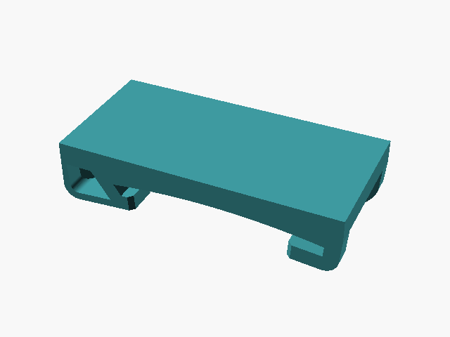<br>Clip mount | KLIPPT | exact | CC-BY-SA-4.0 | [KLIPPT by FH (printables.com/@bequ3) — cut at render time from the designer's own "cable clip small smooth" STL (unmodified): its lips, flange gap and lock as they are, the top filled flat. CC BY-SA 4.0 — see README "Licensing".](https://www.printables.com/model/424351-klippt-locking-cable-clip) | The counterpart of the KLIPPT base: fuse its flat top ("mount") onto a part, and the part slides onto a base like a clip. Lips down as "bot". plate is the solid above the clip's floor. On its own, print it on its end (slide direction up), the way KLIPPT prints its clips: the floor's arch then needs no bridge. |
| 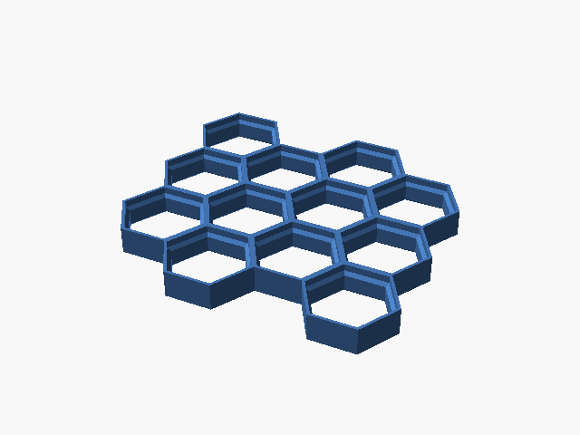<br>Wall panel | Honeycomb Storage Wall | exact | CC-BY-4.0 | [Honeycomb Storage Wall by RostaP; each cell is halfhex() from geru's 3d-scad-hsw-customizable (after Xander and EdwinEesting, CC-BY 4.0), vendored, laid out to match its own grid().](https://github.com/geru/3d-scad-hsw-customizable) | Front face on the bed (the 20mm openings), no supports. Columns are rows cells tall, every other one half a cell lower. flat_edges trims the panel to a rectangle with a flat wall all round, so panels butt together; the end columns are then half cells. "mount" is the back, against the wall. |
| 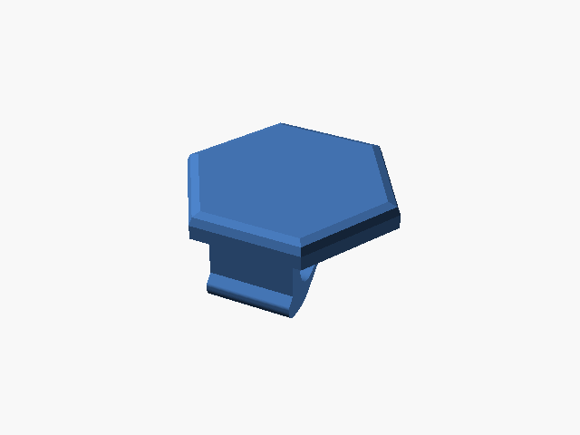<br>Insert | Honeycomb Storage Wall | exact | MIT | [geru's 3d-scad-hsw-clip (Hugh Kern, MIT, after KYZ's V2 clips), vendored](https://github.com/geru/3d-scad-hsw-clip) | Base on the bed, clip up, no supports. A one-way clip: push it into any HSW cell and its spring snaps it behind the lip; press the spring to take it out. The base's top is "mount", for fusing a hook or holder onto. base hex covers the cell, a millimetre short of its neighbours; rect is a bar across it. |
| 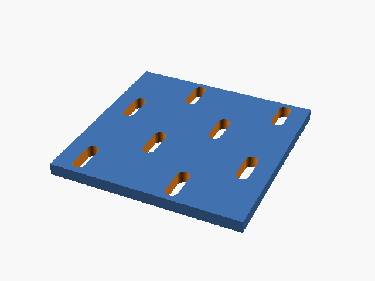<br>Board | Skådis | exact | MIT | [lib/skadis.scad: Skådis's 5 x 15mm slots in a checkerboard on a 20mm grid, checked against breckenedge's parametric-skadis-tower (CC-BY-SA 4.0, measured against, not vendored).](https://github.com/breckenedge/parametric-skadis-tower) | Flat on the bed, no supports. 5mm thick, slots 40mm apart along a row and rows 20mm apart, every other row shifted 20mm, as on a Skådis board; cols counts the slots in a row, in halves: 2.5 is five 20mm cells across, which makes the board symmetric left to right (a whole number leaves one side starting on a gap). The slots are cut 5.2mm wide, so moulded Skådis hooks go in. A board is exactly 2 x cols x rows 20mm cells, so boards butt together. "mount" is the back, against the wall. |
| 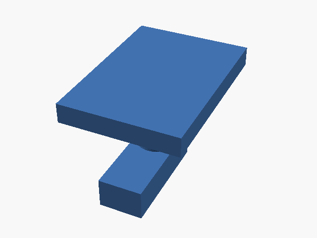<br>Peg | Skådis | exact | MIT | [lib/skadis.scad's hook tab, checked against this repo's Skådis board (itself checked against parametric-skadis-tower).](https://github.com/breckenedge/parametric-skadis-tower) | Print it on its side, a tab flat on the bed, so the layers run along the arm. Each tab goes straight through a slot, drops 6mm and hangs behind the board; lift it to take it off. pegs 2 puts two tabs 40mm apart, for two slots in a row, so the part cannot turn. The plate's front is "mount", for fusing a holder or shelf onto. |
| 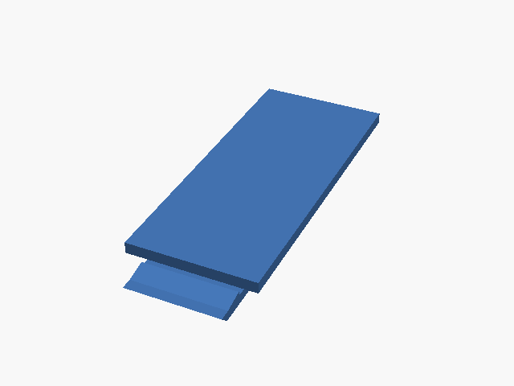<br>Spine | MOLLE | parametric | MIT | [lib/molle.scad, from the PALS grid as the webbing defines it: 25.4mm (1") rows with a 25.4mm gap, bar-tacked every 38.1mm (1.5"). No published geometry drawing or open model to check against.](https://en.wikipedia.org/wiki/Pouch_Attachment_Ladder_System) | Print it on its side, the profile flat on the bed, so the layers run along the tongue; PETG flexes better than PLA. Slide the tongue down behind rows rows of webbing from above, until the barb clicks in under the bottom row; press the tip back to take it off. cols 2 puts two tongues 38.1mm apart, for two columns, so the part cannot swing. webbing is the gap the webbing sits in: measure yours, and go tighter for a firmer grip. The plate's front is "mount". |
| 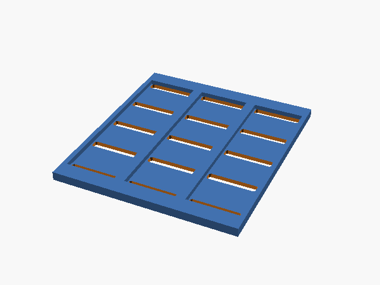<br>Panel | MOLLE | parametric | MIT | [lib/molle.scad: a laser-cut MOLLE panel's slits, every 25.4mm up and 38.1mm across, with a channel behind each column for the strap. No published geometry drawing or open model to check against.](https://en.wikipedia.org/wiki/Pouch_Attachment_Ladder_System) | Front down, ribs up, no supports. A pouch strap goes in at one slit, behind the strip, out at the next; the 30 x 5mm slits take a 1" strap, and channel is the room behind the skin for it to run in (0 for a bare slotted skin). rows counts strips, rows + 1 rows of slits. A panel is exactly cols x 38.1 by (rows + 1) x 25.4mm, so panels butt together. "mount" is the back. |
| 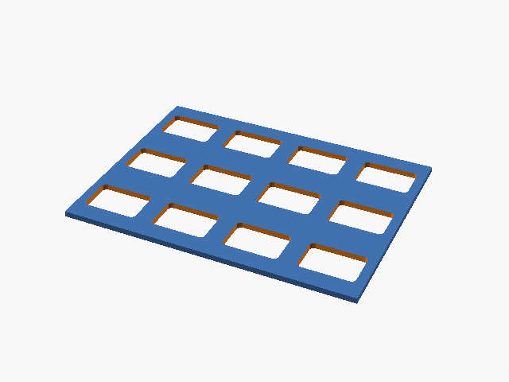<br>Rigid panel | MOLLE | parametric | MIT | [lib/molle.scad: rigid panels have no standard; the default opening is DV8 Offroad's published 1.5" x 1" (38.1 x 25.4mm), on PALS spacing up and a 12.7mm bar across. No open model to check against.](https://nomadicsupply.com/dv8-offroad-universal-molle-panel-23x15-unmp-06/) | Flat on the bed, no supports. Open windows that pouch straps wrap round and molle/insert plugs into. cols x rows openings, each open_w x open_h with open_r corners, centred in pitch_x x pitch_y cells: a panel is exactly cols x pitch_x by rows x pitch_y, so panels butt together. To match a truck panel, measure its openings and the distance between their centres. Mounting holes come from the Holes tab. "mount" is the back. |
| 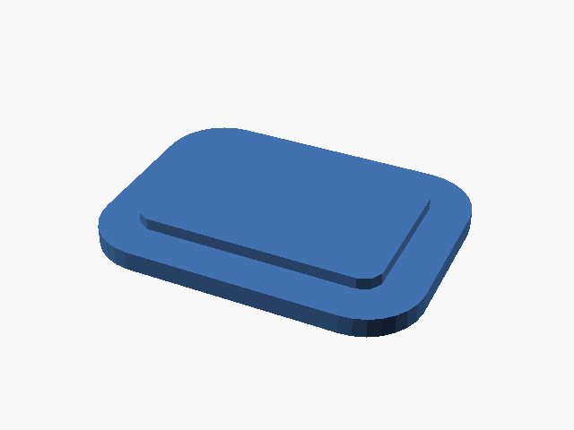<br>Panel insert | MOLLE | parametric | MIT | [lib/molle.scad's rigid-panel opening: a base plate behind the panel and a boss that fits the opening. Rigid panels have no standard, so the opening and the panel's thickness are parameters.](https://nomadicsupply.com/dv8-offroad-universal-molle-panel-23x15-unmp-06/) | Base down, boss up, no supports. Set open_w, open_h and open_r to your panel's opening and panel_t to its thickness (2mm for a typical steel panel, 4 for molle/rigid_panel's default); the boss is FIT_CLEARANCE a side smaller and 0.2mm short of the panel's front, so a bolted part clamps the panel. The base goes in from behind the panel. hole drills one centre through-hole; for heat-set inserts, nut traps or a grid of holes, use the Holes tab on the boss face. "mount" is the boss face. |
| 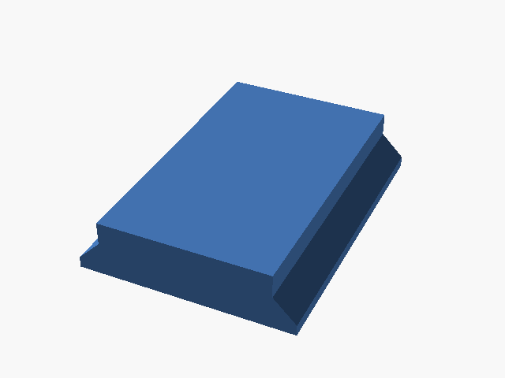<br>Arca-style plate | Camera | parametric | MIT | [lib/camera.scad, from Wimberley's published figure of the Arca-Swiss style dovetail (45° flanks, 38mm real and 41.9mm sharp width); flank height and thickness are this repo's choice. No published standard or open model to check against.](https://www.tripodhead.com/products/product-details2.cfm?product=arca-swiss-geometry) | Clamp face on the bed, flanks up, no supports. Makers differ by tenths of a millimetre: print a short one first and try it in your clamp. It is FIT_CLEARANCE a side narrower than nominal. screw cuts a slot for a 1/4"-20 camera screw, its head sunk from the clamp face; leave it off for a plate fused onto a part. "mount" is the top, where the camera or part sits. |
| 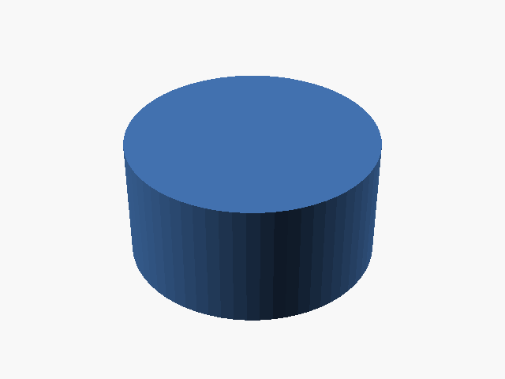<br>Tripod socket | Camera | exact | MIT | [BOSL2's UTS threads (threaded_rod() as a mask) and its hex nut table, vendored; checked with BOSL2's own screw and nut.](https://github.com/BelfrySCAD/BOSL2) | Mouth on the bed, no supports. A part fused onto its top ("mount") screws onto a tripod, light stand or camera rig. size 1/4 is the camera thread (1/4"-20), 3/8 the tripod-head one (3/8"-16). style thread prints the thread, opened up by FIT_CLEARANCE; nut is a pocket for a real hex nut, pressed in from the mouth, for weight a printed thread will not hold. |
| 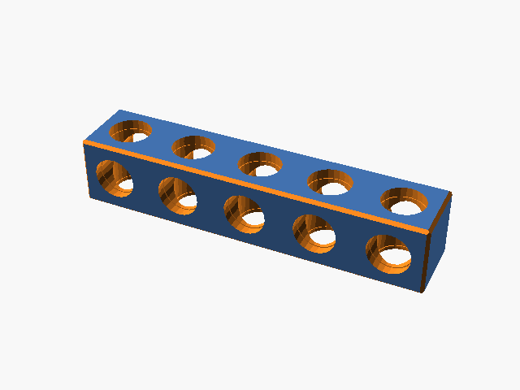<br>Beam | BitBeam | exact | BSD-3-Clause | [bitbeam-lib (ondratu, BSD-3-Clause), vendored; dimensions per bitbeam.cc](https://github.com/ondratu/bitbeam-lib) | Print flat, no supports. 4.8mm holes on an 8mm pitch through top and bottom, and through the sides with side_holes on. LEGO Technic-compatible. |
| 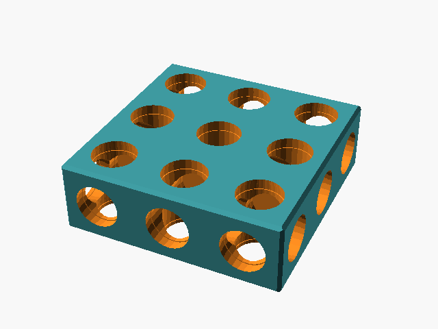<br>Plate | BitBeam | exact | BSD-3-Clause | [bitbeam-lib (ondratu, BSD-3-Clause), vendored; dimensions per bitbeam.cc. Nobody publishes a model of a plate like this, so there is no reference geometry to check against.](https://github.com/ondratu/bitbeam-lib) | Flat on the bed, no supports. Every hole is a real BitBeam hole, top and side. Side holes need height 1 (8mm); go thinner and turn side_holes off. Sizes are in 8mm units. |
| 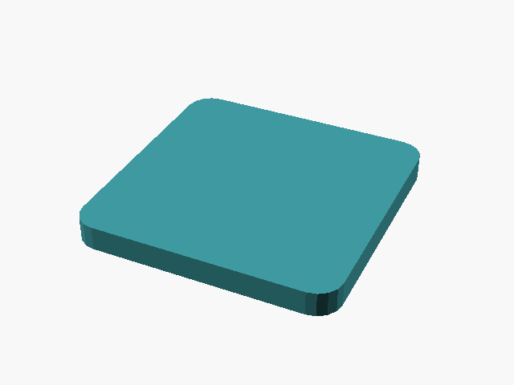<br>Flat plate | Basics | exact | MIT | Generic geometry, not tied to an external spec | Flat on the bed, no supports. Anchors on all six faces. 42 x 42mm with 4mm corners by default — one Gridfinity unit, so it lines up with a Gridfinity base or baseplate. |
| 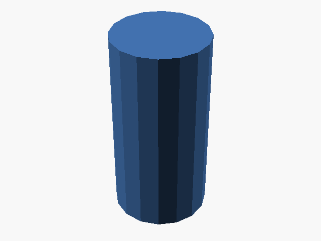<br>Round post | Basics | exact | MIT | Generic geometry, not tied to an external spec | Stands on its flat end ("bot"), no supports. |
| 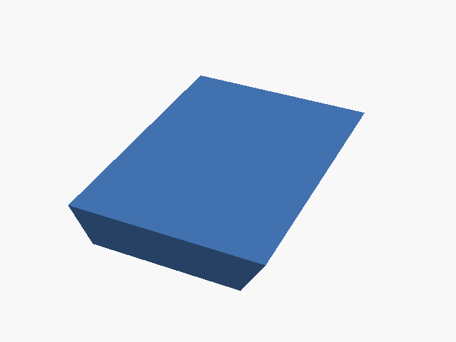<br>Dovetail rail | Basics | exact | MIT | Generic geometry, not tied to an external spec | Tip down, no supports. A generic dovetail, not DeckMate-compatible — import Mechanism's own model for that. |
| 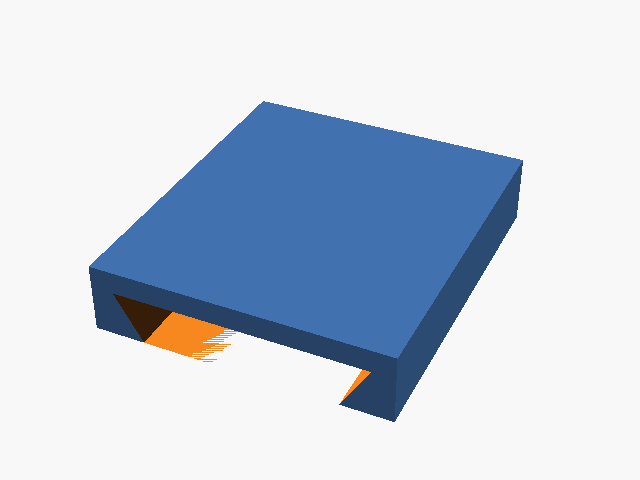<br>Dovetail channel | Basics | exact | MIT | Generic geometry, not tied to an external spec | Mouth down, no supports. Mates with the dovetail rail. |
| 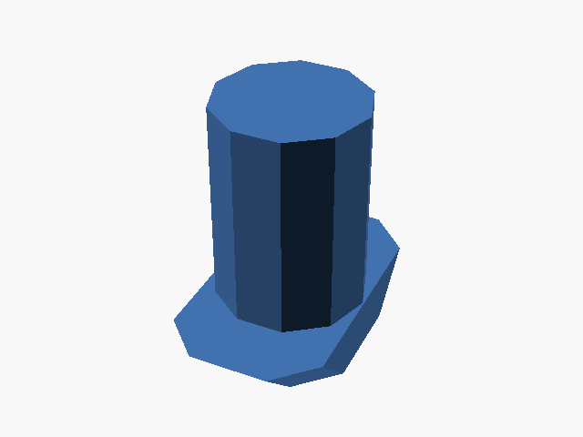<br>T-slot tab (hammer-head) | 2020 Extrusion | parametric | MIT | [Slot geometry measured off NopSCADlib's E2020t (GPL-3.0 — measured against, not vendored)](https://github.com/nophead/NopSCADlib) | Check EX_* in lib/constants.scad against your rail. tab_len up to 6mm drops into the slot face-first and twists to lock; a longer head feeds in from an open end. |
| 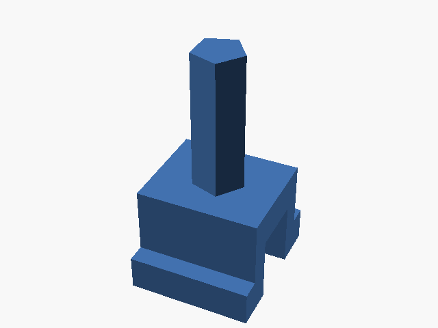<br>Snap-in clip | 2020 Extrusion | parametric | MIT | [Slot geometry measured off NopSCADlib's E2020t (GPL-3.0 — measured against, not vendored)](https://github.com/nophead/NopSCADlib) | Check EX_* in lib/constants.scad against your rail. Pushes straight into the slot mid-rail. Print in PETG or nylon so the legs can flex. |
| 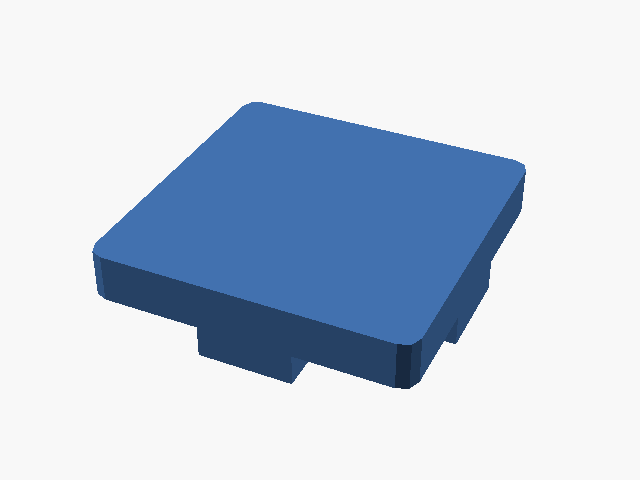<br>End-face plate | 2020 Extrusion | parametric | MIT | [Slot geometry measured off NopSCADlib's E2020t (GPL-3.0 — measured against, not vendored)](https://github.com/nophead/NopSCADlib) | Check EX_* in lib/constants.scad against your rail. Keys print face-down; the plate corners overhang them, so add a brim. |
| 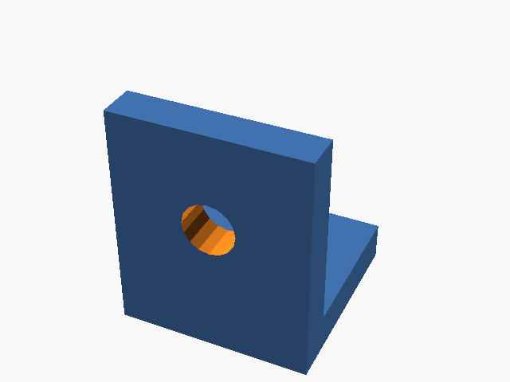<br>Corner bracket | 2020 Extrusion | parametric | MIT | [Slot geometry measured off NopSCADlib's E2020t (GPL-3.0 — measured against, not vendored)](https://github.com/nophead/NopSCADlib) | Check EX_* in lib/constants.scad against your rail. Base flange down; check the bore spacing against your T-nuts. |
| 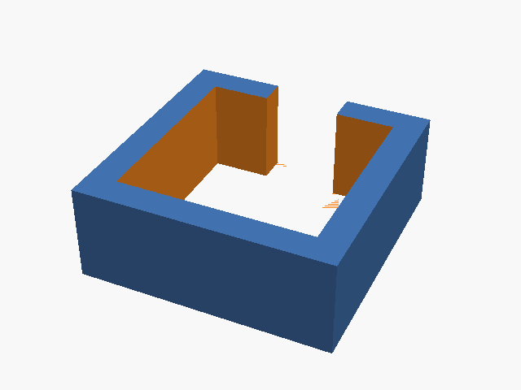<br>Profile C-clip | 2020 Extrusion | parametric | MIT | [Slot geometry measured off NopSCADlib's E2020t (GPL-3.0 — measured against, not vendored)](https://github.com/nophead/NopSCADlib) | Check EX_* in lib/constants.scad against your rail. Snaps over the outside of the profile; print with the ring axis vertical. |
| 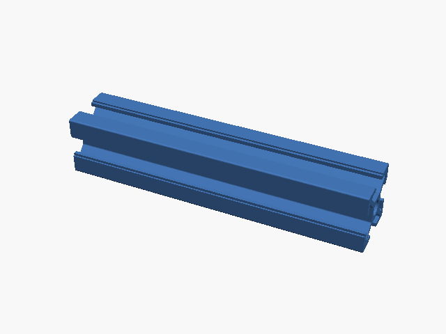<br>T-slot rail (printable stand-in) | 2020 Extrusion | parametric | Apache-2.0 | [AluminumExtrusionProfile (Jen Reed, Apache-2.0), vendored — its 2020 preset, which is close to but not E2020t; references.yaml records the gap.](https://github.com/ServerNinja/OpenSCAD_AluminumExtrusionProfile_Library) | A printable stand-in for real rail, for trying fittings and Bench layouts. Lies flat by default; "vertical" stands it on end. Slots along the top at 20mm pitch, on both ends and on the bottom. slot "v" is a V-slot profile. |
<!-- CATALOGUE:END -->

## User overrides

"Gridfinity should always have magnet holes on" is a preference, not a change to the repo. Saved
overrides are a layer on top of the catalogue defaults:

    catalogue default -> saved user override -> this render's value

```bash
foundry defaults set gridfinity/base --magnets   # always on, from now on
foundry defaults show gridfinity/base
foundry defaults clear gridfinity/base
foundry settings set --fit-clearance 0.25        # global: FIT_CLEARANCE
foundry settings set --circle-detail fine        # global: CIRCLE_DETAIL — rounder holes, slower
foundry render gridfinity/base --no-user-config  # true catalogue defaults (what tests and CI use)
```

Stored as OpenSCAD Customizer JSON under `~/.config/connector-foundry/`, so a saved file also
opens as a parameter set in the OpenSCAD GUI. The web app does the same resolution in
`localStorage`; a dot marks any field that differs from the catalogue default, and "Save as my
default" works per part. Drag the sidebar's edge to make it wider or narrower (double-click it to reset); the width is kept, and the same in every tab. The gear icon holds the global settings — including the part list itself:
untick a system or a single part there and it leaves the Library sidebar and both Bench pickers,
so the list shows only what you actually print. Hidden parts still work in any bench, link, or
config that uses them; "Show all" brings everything back.

## Accuracy

A wrong part still renders, is watertight, and has a stable bounding box. Golden dimensions catch
a part *moving*; only a comparison against someone else's model of the same standard catches it
being *wrong*. `references.yaml` declares those comparisons; `make refs` fetches the sources
(submodules, or pinned commits into gitignored `refs/`) and `make verify` runs them:

- **shape** — our part and the reference through the same OpenSCAD binary: volume, symmetric
  surface distance, and cross-section IoU at declared heights. IoU is what catches a mating profile
  that is the right size and the wrong shape.
- **fit** — our part and its real counterpart in the assembled pose, intersected: interference
  volume and smallest clearance.

`confidence: exact` is a claim, and a test fails if a part makes it without a check behind it. The
harness earned its keep: before it existed, the Gridfinity foot was 5.9 mm undersized, the GoPro
buckles could not interleave at all, the openGrid cells were invented geometry (IoU 0.23), and
three 2020 fittings drove tens to hundreds of mm³ into the rail.

A `kind: file` reference takes a STEP or STL you supply (manufacturer CAD behind a login) — drop
it in `refs/manual/` and uncomment the example in `references.yaml`.

## Licensing

This repository's own files are MIT. Thirteen parts are not, and each catalogue entry says so:

| Parts | Licence | Why |
| --- | --- | --- |
| `opengrid/board`, `opengrid/snap` | **CC-BY-NC-SA 4.0** | They run `vendor/QuackWorks` code. NonCommercial applies to that use, ShareAlike to adaptations. Upstream licenses *generated tiles* CC-BY, so what you print is unrestricted. |
| `opengrid/openconnect`, `opengrid/multiconnect` | **CC-BY 4.0** | They run `vendor/opengrid-projects` code (the snap body; the openConnect head; the screw body's thread, `lib/ogthread.scad`, rewritten from it). Attribution to mitufy, nothing else. The Holes tab's openConnect slot and openGrid thread come from the same library; its MultiConnect slot and the MultiConnect head are this repo's MIT code. |
| `deckmate/innie`, `deckmate/outie`, `deckmate/universal` | **CC BY-NC 4.0** | Mechanism's own STLs (the slim Outie is cut, at render time, from their Adhesive Puck STL), redistributed unmodified under the terms they publish their files under. NonCommercial applies to the files, to prints of them, and to anything fused onto them. The screw pattern's dimensions in `lib/constants.scad` are facts; the generated flange is this repo's MIT code. |
| `klippt/base`, `klippt/clip_mount`, the Holes tab's KLIPPT channel | **CC BY-SA 4.0** | KLIPPT by FH ([printables.com/@bequ3](https://www.printables.com/@bequ3), [model 424351](https://www.printables.com/model/424351-klippt-locking-cable-clip)): the designer's own files (the base STEP tessellated, the screw base and "cable clip small smooth" STLs as published), redistributed unmodified with that credit; the clip mount and the Holes tab's KLIPPT channel (`lib/klippt.scad`) are cut from the clip at render time. ShareAlike applies to adaptations — a part with a base or a clip mount fused onto it, or a KLIPPT channel cut into it, is one, so share it under BY-SA. |
| `hsw/wall` | **CC-BY 4.0** | It runs `vendor/hsw-customizable` code (Xander, EdwinEesting, geru). Attribution, nothing else. |
| `bitbeam/beam`, `bitbeam/plate` | **BSD-3-Clause** | Call into `vendor/bitbeam-lib`. Permissive, just not MIT. |
| `extrusion2020/rail` | **Apache-2.0** | Calls into `vendor/AluminumExtrusionProfile`. Permissive, just not MIT. |
| everything else | MIT | — |

BitBeam's own site (bitbeam.cc) is CC-BY-NC-SA and its STL pack is not used; the geometry comes
from `bitbeam-lib`, a separately and permissively licensed implementation by the same author, and
from `technic.scad` for the pin and axle (a BitBeam pin *is* a LEGO Technic pin). NopSCADlib (GPL)
is measured, never called or vendored. The Honeycomb Storage Wall is RostaP's design, whose own
models are CC BY-NC; neither is used here. The wall and the insert run two OpenSCAD
implementations their authors publish under CC-BY 4.0 and MIT. `openscad-wasm` bundles OpenSCAD itself (GPL-2.0) as an
external tool the browser runs, the same way the CLI shells out to `openscad`. The web app's STEP
reader, `occt-import-js`, is Open CASCADE Technology (LGPL-2.1 with the OCCT exception) compiled
to WebAssembly and loaded as a separate file only when a STEP file is imported.

## Repo layout

```
lib/             constants, slot/joint conventions, shared helpers
parts/           one .scad per part, grouped by system
assemblies/      example compositions of two or more parts
cli/             foundry.py — render/build/preview/goldens/readme CLI
tools/           reference cache + the comparison engine behind `make verify`
references.yaml  what each part is checked against, and how
tests/           soundness, anchors, recorded dimensions, reference checks
web/             browser app (openscad-wasm)
vendor/          upstream implementations, as git submodules
refs/            reference cache (gitignored)
```
